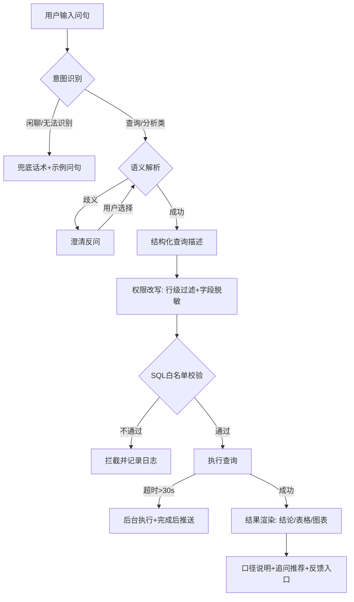
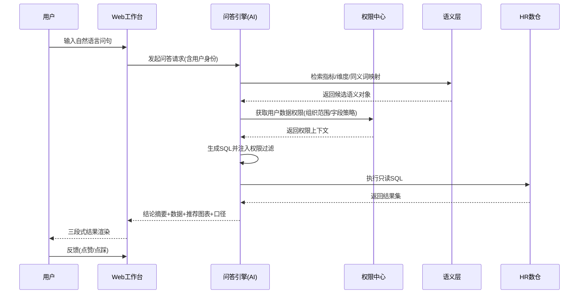
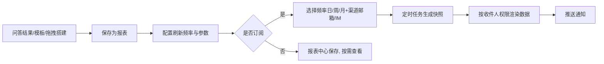

# HR智能问数 产品需求文档（PRD）

| 文档属性 | 内容 |
|---|---|
| 产品名称 | HR智能问数（HR ChatBI） |
| 文档编号 | PRD-HRCHATBI-001 |
| 版本号 | V1.0 |
| 文档状态 | 评审稿 |
| 作者 | 产品部 |
| 创建日期 | 2026-09-13 |
| 密级 | 内部 |

### 修订历史

| 版本 | 日期 | 修订人 | 修订说明 |
|---|---|---|---|
| V1.0 | 2026-09-13 | 产品部 | 基于产品设计方案V1.0输出完整PRD |

### 评审记录

| 角色 | 姓名 | 评审意见 | 结论 |
|---|---|---|---|
| 设计负责人 | 待定 | — | 待评审 |
| 研发负责人 | 待定 | — | 待评审 |
| 测试负责人 | 待定 | — | 待评审 |
| HR业务方 | 待定 | — | 待评审 |

---

## 目录

1. [产品概述](#1-产品概述)
2. [产品范围](#2-产品范围)
3. [核心功能需求](#3-核心功能需求)
4. [用户故事](#4-用户故事)
5. [交互流程](#5-交互流程)
6. [数据需求](#6-数据需求)
7. [业务规则](#7-业务规则)
8. [非功能需求](#8-非功能需求)
9. [验收标准](#9-验收标准)
10. [项目排期](#10-项目排期)
11. [风险评估](#11-风险评估)
12. [附录](#12-附录)

---

## 1. 产品概述

### 1.1 背景与问题

企业HR部门在日常工作中面临三大数据困境：

| 痛点 | 现状描述 | 量化影响 |
|---|---|---|
| 取数靠IT | HR向IT/数据团队提需求→排期→交付，单次取数周期2-5天 | 重复性取数占用IT资源约30% |
| 分析靠Excel | 手工透视、口径不统一、版本混乱，跨部门数据对不上 | 报表口径争议频发，返工率高 |
| 决策靠经验 | 人效、流失、编制等关键决策缺乏及时数据支撑 | 问题发现滞后，人力成本失控风险 |

### 1.2 产品定位与价值

**一句话定位**：面向HR部门的AI对话式数据分析助手——让HR用一句话获取人力数据洞察，无需依赖IT取数或手工做表。

| 痛点 | 产品价值 |
|---|---|
| 取数靠IT | 秒级自助问答，取数周期从天级降至秒级 |
| 分析靠Excel | 自动生成可视化报表，指标口径全公司统一 |
| 决策靠经验 | 自然语言归因洞察，支撑编制、薪酬、招聘决策 |

### 1.3 产品目标与成功指标

| 目标类型 | 指标 | 目标值 | 度量方式 |
|---|---|---|---|
| 北极星指标 | 问数成功率（准确返回正确数据的会话占比） | ≥ 90% | 抽样评审 + 用户反馈修正 |
| 效率指标 | IT临时取数工单量下降 | ≥ 50% | 工单系统统计 |
| 活跃指标 | HR目标用户周活跃率 | ≥ 60% | 埋点统计 |
| 体验指标 | 答案满意度（点赞/点踩比） | ≥ 85% 好评率 | 会话内反馈埋点 |
| 性能指标 | 简单查询P95响应时间 | < 3s | APM监控 |

### 1.4 目标用户与角色定义

| 角色 | 使用频率 | 典型诉求 | 权限特征 |
|---|---|---|---|
| HRBP/HR专员 | 高频（日均5-20次） | 日常查数、做部门报表 | 所辖组织范围，薪酬字段受限 |
| HR负责人/HRD | 中频（周均3-10次） | 人效分析、对比决策 | 所管一级/二级组织，可看汇总薪酬 |
| CHO/管理层 | 低频（周均1-3次） | 大盘趋势、订阅报表 | 全集团范围，字段级授权 |
| 平台系统管理员（ADMIN） | 按需 | 租户生命周期、平台配置、授权与平台审计 | 平台控制面；默认不等于拥有所有租户敏感业务数据权限 |
| 租户管理员（TENANT_ADMIN） | 按需 | 管理本租户用户、LLM配置和本租户审计 | 严格限定本租户，不可管理其他租户或平台级权限 |
| 数据管理员 | 按需 | 数据源接入、同步监控、口径维护 | 数据管理模块 |

### 1.5 名词解释

| 术语 | 定义 |
|---|---|
| 问数 | 用户通过自然语言提问，系统返回数据结果与图表的交互过程 |
| NL2SQL | 自然语言转结构化查询语言的技术 |
| 语义层 | 连接业务语言与物理数据的中间层，包含指标定义、维度、同义词映射 |
| 澄清反问 | 系统对模糊提问发起的多选式追问，用于补全查询条件 |
| 指标口径 | 指标的业务定义、计算公式、统计周期、过滤条件的规范化说明 |
| 行级权限 | 按组织/人员范围过滤数据的权限控制方式，在SQL层注入 |
| 字段级脱敏 | 对敏感字段（薪酬、证件号等）按角色隐藏或部分遮蔽 |

---

## 2. 产品范围

### 2.1 本期范围（In Scope）

- Web端对话式问数工作台（含多轮对话、澄清反问）
- 结果可视化呈现（数字卡/表格/图表）与多维对比分析
- 报表中心（自定义报表、模板库、订阅推送）
- HR域数据集成（HRIS/考勤/薪酬/绩效/招聘）
- 权限管理（组织范围、字段脱敏、功能权限、审计）
- 管理后台（语义层配置、同义词库、问句集标注、同步监控）

### 2.2 非范围（Out of Scope）

- 写操作：不支持通过对话修改HR系统数据（只读产品）
- 移动端独立App：本期仅支持IM机器人推送与H5轻量查看（P2）
- 非HR域数据（财务、销售等）：本期不接入
- 自助搭建数据大屏：由既有BI平台承接

---

## 3. 核心功能需求

### 3.1 功能架构

```
┌──────────────────────────────────────────────────────┐
│ 交互层：Web对话工作台 │ 报表中心 │ IM推送(H5) │ 管理后台 │
├──────────────────────────────────────────────────────┤
│ 应用层：问答引擎 │ 分析引擎 │ 报表引擎 │ 订阅引擎 │ 权限中心 │
├──────────────────────────────────────────────────────┤
│ AI能力层：意图识别 → 槽位补全 → NL2SQL → 权限改写      │
│          → 查询执行 → 图表推荐 → 归纳生成 → 归因分析   │
├──────────────────────────────────────────────────────┤
│ 语义层：指标定义 │ 维度模型 │ 同义词库 │ 口径管理 │ 问句集 │
├──────────────────────────────────────────────────────┤
│ 数据层：HR数仓（人员/组织/考勤/薪酬/绩效/招聘主题域）   │
│        ← ETL ← HRIS / 考勤 / 薪酬 / 绩效 / 招聘ATS    │
└──────────────────────────────────────────────────────┘
```

### 3.2 功能需求清单

| 编号 | 功能模块 | 功能点 | 优先级 | 版本 |
|---|---|---|---|---|
| FR-01 | 智能问数 | 自然语言查询 | P0 | V1 |
| FR-02 | 智能问数 | 澄清反问 | P0 | V1 |
| FR-03 | 智能问数 | 多轮对话（上下文继承） | P0 | V1 |
| FR-04 | 智能问数 | 结果三段式呈现 | P0 | V1 |
| FR-05 | 智能问数 | 口径溯源与SQL查看 | P1 | V1 |
| FR-06 | 智能问数 | 纠错反馈 | P0 | V1 |
| FR-07 | 可视化 | 图表自动推荐与切换 | P0 | V1 |
| FR-08 | 可视化 | 明细表格下钻 | P1 | V1 |
| FR-09 | 分析 | 同比/环比/部门对比 | P1 | V1.5 |
| FR-10 | 分析 | 实际vs编制达成率 | P1 | V1.5 |
| FR-11 | 分析 | 指标归因拆解 | P2 | V2 |
| FR-12 | 报表中心 | 问答结果存为报表 | P1 | V1.5 |
| FR-13 | 报表中心 | 标准报表模板库 | P1 | V1.5 |
| FR-14 | 报表中心 | 报表订阅推送 | P1 | V1.5 |
| FR-15 | 数据集成 | HR域数据源接入 | P0 | V1 |
| FR-16 | 数据集成 | 同步监控与告警 | P0 | V1 |
| FR-17 | 权限 | 组织范围（行级）权限 | P0 | V1 |
| FR-18 | 权限 | 字段级脱敏 | P0 | V1 |
| FR-19 | 权限 | 功能与操作权限 | P0 | V1 |
| FR-20 | 安全 | 审计日志 | P0 | V1 |
| FR-21 | 管理后台 | 语义层配置（指标/维度） | P0 | V1 |
| FR-22 | 管理后台 | 同义词库管理 | P1 | V1.5 |
| FR-23 | 管理后台 | 标注问句集与评测 | P1 | V1.5 |
| FR-24 | 降级 | 预设问句缓存直查 | P0 | V1 |

### 3.3 详细功能需求

#### FR-01 自然语言查询

| 属性 | 说明 |
|---|---|
| 需求描述 | 用户在对话框输入自然语言问句，系统识别意图并返回准确数据结果 |
| 优先级 | P0 |
| 前置条件 | 用户已登录且具有目标数据的查询权限 |

**处理逻辑**：

1. 系统接收问句文本，进行意图分类：查询类 / 分析类 / 操作类（生成报表、订阅）/ 闲聊兜底
2. 查询类与分析类问句进入语义解析，基于语义层将问句映射为「指标 + 维度 + 筛选条件 + 时间范围」的结构化查询描述
3. 结构化查询经权限改写（注入行级过滤与字段脱敏规则）后生成只读SQL
4. SQL经白名单校验后执行，返回结果集
5. 系统生成结论摘要与推荐图表，随结果一同返回

**输出**：三段式结果（结论 → 数据 → 图表）+ 口径说明 + 追问推荐

**异常流**：
- 意图无法识别 → 返回兜底话术 + 推荐示例问句 + 人工反馈入口
- 解析成功但查询超时 → 返回进度提示，后台继续执行，完成后推送（超过30s）
- 无权限 → 明确提示「您暂无XX数据的查看权限，请联系管理员」

#### FR-02 澄清反问

| 属性 | 说明 |
|---|---|
| 需求描述 | 当问句存在歧义（缺失时间范围、指标多口径、组织多含义）时，系统主动发起澄清反问 |
| 优先级 | P0 |

**触发条件（满足其一即触发澄清）**：

| 歧义类型 | 示例 | 反问策略 |
|---|---|---|
| 时间缺失 | 「查一下离职率」 | 提供候选：近30天 / 本季度 / 本年度 |
| 指标多口径 | 「人力成本」含应发/实发口径 | 提供口径选项并展示口径说明 |
| 组织歧义 | 「研发部」存在同名二级部门 | 展示候选部门树供选择 |
| 维度缺失 | 「员工名单」未说明范围 | 反问组织/标签范围 |

**规则**：
- 单次澄清最多反问2个问题，避免交互过载
- 澄清选项不超过5个，超出时引导用户细化表述
- 用户选择后，答案按所选口径返回，并记录该偏好（同一用户后续同问句默认沿用，可更改）

#### FR-03 多轮对话

| 属性 | 说明 |
|---|---|
| 需求描述 | 支持基于上下文的追问，继承上一轮的时间、组织、指标等条件 |
| 优先级 | P0 |

**支持能力**：
- 主题继承：「那研发部呢？」→ 继承指标与时间，仅替换组织维度
- 条件修改：「换成按季度看」→ 仅替换时间粒度
- 对比延伸：「和去年比呢？」→ 在当前结果上增加同比
- 上下文有效期：单会话内有效；跨会话不继承；会话超30分钟无交互自动过期

#### FR-04 结果三段式呈现

| 段落 | 内容 | 规则 |
|---|---|---|
| 结论层 | 数字卡或一句话结论 | 直接回答问题本身，如「上月入职128人，环比+12%」 |
| 数据层 | 明细表格 | 支持排序、分页（默认20条/页）、复制、导出（需权限） |
| 图表层 | 可视化图表 | AI按数据形态推荐图型，用户可手动切换 |

**图表推荐规则**：

| 数据形态 | 推荐图型 |
|---|---|
| 单指标单值 | 数字卡 |
| 时间序列趋势 | 折线图/面积图 |
| 分类对比（≤8类） | 柱状图 |
| 分类对比（>8类） | 条形图（按值排序） |
| 占比构成 | 饼图/环形图（≤6类，超出归「其他」） |
| 两指标相关性 | 散点图 |
| 多指标多维 | 组合图/热力图 |

#### FR-05 口径溯源与SQL查看

- 每个答案底部展示：指标口径摘要、统计时间范围、数据更新时间（如「数据更新至2026-09-12 06:00」）
- 点击「查看查询逻辑」展开系统生成的SQL（只读展示，不可编辑）
- 点击「口径详情」跳转语义层指标定义页

#### FR-06 纠错反馈

- 每条答案提供「有用 👍 / 无用 👎」反馈
- 点踩时必选原因：数据不对 / 图表不对 / 没听懂问题 / 其他（可补充描述）
- 反馈数据进入标注队列，用于问句集回归测试（FR-23）

#### FR-07 图表自动推荐与切换

见 FR-04 图表推荐规则；用户切换图型后，会话内保持用户选择。

#### FR-08 明细表格下钻

- 表格中组织维度支持点击下钻：一级部门 → 二级部门 → 三级部门 → 人员明细（受权限限制）
- 每次下钻生成新的对话轮次，保留面包屑可返回

#### FR-09 对比分析（V1.5）

| 对比类型 | 示例问句 | 呈现方式 |
|---|---|---|
| 同比 | 「离职率和去年比呢」 | 双系列折线/柱状 + 变化率标注 |
| 环比 | 「入职人数环比」 | 柱状图 + 环比箭头与百分比 |
| 部门横向 | 「对比各一级部门人均薪酬」 | 排序条形图（脱敏规则适用） |
| 实际vs编制 | 「各部门编制达成率」 | 子弹图/达成率表，低于80%红色预警 |

#### FR-11 归因分析（V2）

- 触发方式：用户问「为什么XX指标变化」或点击答案上的「分析原因」
- 输出：异动贡献度拆解（按维度：组织/司龄段/职级/岗位序列），列出Top3贡献因素及量化贡献占比
- 说明：归因结论标注「辅助分析，仅供参考」

#### FR-12/13/14 报表中心（V1.5）

| 功能 | 需求说明 |
|---|---|
| 问答存为报表 | 任一问答结果可一键保存为报表，继承当时口径；支持重命名、分类、删除 |
| 模板库 | 预置模板：人力月报、编制盘点、离职分析、招聘漏斗、考勤汇总、人力成本等≥10个；模板参数（组织/周期）可配置 |
| 自定义报表 | 可视化拖拽字段（指标/维度/筛选）生成报表，无需写SQL |
| 定时刷新 | 报表数据按日刷新（默认T+1 08:00前） |
| 订阅推送 | 支持日/周/月频率，推送至邮箱或IM（企业微信/钉钉/飞书）；推送内容为报表快照链接，访问时实时校验权限 |

#### FR-15/16 数据集成

| 需求 | 说明 |
|---|---|
| 接入范围 | HRIS（组织/人员/异动）、考勤、薪酬、绩效、招聘ATS |
| 同步策略 | 维表T+1全量；异动事实表准实时增量（CDC，延迟≤15分钟）；详见第6章 |
| 同步监控 | 每日同步任务状态看板：成功/失败/延迟；失败自动重试3次，仍失败触发IM告警至数据管理员 |
| 数据质量 | 入仓校验规则详见6.5；校验失败数据进入隔离区并告警 |

#### FR-17 组织范围（行级）权限

- 权限主体：用户/用户组；权限对象：组织节点（含下级）
- 实现方式：查询生成阶段由权限中心将用户的可见组织范围注入SQL过滤条件（WHERE org_path IN (...)），禁止依赖前端过滤
- 生效时效：权限变更实时生效（≤5分钟）

#### FR-18 字段级脱敏

| 数据类别 | 默认策略 |
|---|---|
| 薪酬类（工资、奖金、社保） | 仅薪酬岗位角色可见明文；其他角色不可见该字段 |
| 证件号、手机号、银行卡号 | 全角色默认脱敏（如 110***********1234），明文需单独授权+审批 |
| 姓名、工号 | 组织范围内明文可见 |
| 绩效结果 | 组织范围内明文可见 |

#### FR-19 功能与操作权限

| 权限点 | 说明 |
|---|---|
| 明细查看 | 查看人员级明细需单独授权（默认仅到部门汇总） |
| 数据导出 | 导出Excel/CSV需授权；单次导出≤5000行；文件带水印（用户名+工号+时间） |
| 报表创建/订阅 | 默认全员可创建自己的报表；订阅他人报表需报表所有者开放 |
| 管理后台 | 仅管理员角色可见 |

#### FR-20 审计日志

记录内容：用户、时间、问句原文、生成的SQL、返回行数、是否导出、导出文件名、访问IP。
保存期限：≥ 3年；支持按用户/时间/敏感字段检索；日志仅管理员与审计角色可查。

#### FR-21 语义层配置（管理后台）

- 指标管理：指标名称、业务定义、计算公式、所属主题域、默认时间粒度、可用维度
- 维度管理：维度层级（如组织树）、枚举值、展示名
- 变更管理：口径变更需审批（数据管理员提交 → HR数据负责人审批），保留版本历史，变更后自动通知订阅相关报表的用户

#### FR-24 降级方案

- 高频Top 200问句预编译为缓存SQL模板，AI服务不可用时直查返回
- 降级期间前端明确提示「智能解析暂不可用，已为您返回预设查询」

---

## 4. 用户故事

> 格式：作为<角色>，我希望<能力>，以便<价值>。验收条件以AC-Given/When/Then描述。

### US-01 日常查询（HRBP，P0）

> 作为HRBP，我希望用一句话查到所辖部门上月入职人数，以便不用再提IT工单。

**验收条件**：
- AC1：Given我输入「上月入职了多少人」，When提交，Then 3秒内返回数字卡结论，数值与数仓核对一致
- AC2：Given答案返回，Then同时展示明细表格与趋势图表，并标注数据更新时间
- AC3：Given我问「上月研发中心入职了多少人」，Then结果自动限定我所辖组织内可查询的范围

### US-02 复杂条件查询（HRBP，P0）

> 作为HRBP，我希望用多条件组合查到人员名单，以便快速定位目标人群。

**验收条件**：
- AC1：Given我输入「司龄3年以上、绩效B以上、职级P6-P8的女员工名单」，Then返回符合全部条件的明细名单
- AC2：Given结果超出我组织权限的人员，Then不出现在名单中且总数不含该部分
- AC3：Given证件号/手机号字段，Then默认脱敏展示

### US-03 澄清反问（HRBP，P0）

> 作为HRBP，当我的问题有歧义时，我希望系统主动追问，以便拿到我真正想要的数据。

**验收条件**：
- AC1：Given我输入「查一下离职率」（无时间范围），Then系统反问时间候选而非直接返回错误答案
- AC2：Given我选择「本年度、按部门」，Then返回对应结果且口径说明中体现我的选择

### US-04 对比分析（HRD，P1）

> 作为HRD，我希望一键对比各季度各部门离职率，以便发现异常组织。

**验收条件**：
- AC1：Given我输入「对比今年Q1-Q3各部门离职率」，Then返回分组柱状图与对比表格
- AC2：Given离职率超过预警阈值（≥15%），Then该部门标红提示

### US-05 报表订阅（HRD，P1）

> 作为HRD，我希望每月自动收到人力成本月报，以便不用每月手动催报表。

**验收条件**：
- AC1：Given我订阅「人力成本月报-按部门」，Then每月1日09:00收到邮件/IM推送
- AC2：Given推送链接被转发给无权限用户，Then该用户打开时无权查看对应数据

### US-06 管理层看数（CHO，P1）

> 作为CHO，我希望直接问「集团在职人数和人效趋势」，以便会上随时引用准确数据。

**验收条件**：
- AC1：Given我提问，Then返回近12个月在职人数趋势与人效（人均营收）趋势组合图
- AC2：Given数据口径变更，Then答案口径说明展示最新口径及生效日期

### US-07 语义层配置（数据管理员，P0）

> 作为数据管理员，我希望在后台维护指标口径和同义词，以便持续提升问数准确率。

**验收条件**：
- AC1：Given我新增指标「主动离职率」并定义公式，Then保存后用户即可查询该指标
- AC2：Given我修改某指标口径并提交审批，Then审批通过前线上仍使用旧口径
- AC3：Given口径变更审批通过，Then订阅相关报表的用户收到变更通知

### US-08 降级兜底（HRBP，P0）

> 作为HRBP，当AI解析服务异常时，我仍希望查到常用数据，以便工作不被中断。

**验收条件**：
- AC1：GivenAI服务不可用，When我输入预设Top200内的问句，Then直接返回缓存模板查询结果
- AC2：Given降级期间，Then页面明确展示降级提示

---

## 5. 交互流程

### 5.1 问数主流程



### 5.2 问数执行时序（系统视角）



### 5.3 报表生成与订阅流程



### 5.4 异常与降级流程

| 场景 | 系统行为 | 用户感知 |
|---|---|---|
| 意图无法识别 | 记录日志进入优化队列 | 兜底话术 + 推荐示例问句 + 「转人工反馈」 |
| 查询超时（>30s） | 转后台异步执行 | 提示「正在查询，完成后通知您」 |
| 无数据权限 | 拦截并记审计日志 | 「您暂无XX数据权限，请联系管理员」 |
| 数据源/同步失败 | 告警数据管理员 | 答案标注「数据可能延迟，更新至X日」 |
| AI服务异常 | 切换预设问句缓存直查 | 降级提示条「智能解析暂不可用」 |

### 5.5 核心页面结构说明

| 页面 | 主要区块 |
|---|---|
| 对话工作台 | 左侧：历史会话列表；中部：对话流（问答卡片）；右侧（可折叠）：当前答案详情（表格全览/图表切换/口径详情） |
| 报表中心 | 报表列表（我创建的/订阅的/模板库）；报表详情页（筛选器+图表+表格+订阅设置） |
| 管理后台 | 语义层配置、数据源与同步监控、权限管理、审计日志、问句评测 |

> 视觉与交互规范遵循公司统一设计系统，各模块布局、色彩、字体、组件尺寸保持一致性（详见设计稿）。

---

## 6. 数据需求

### 6.1 数据源清单

| 数据源系统 | 数据内容 | 同步方式 | 频率 | 延迟要求 |
|---|---|---|---|---|
| HRIS | 组织、人员主数据、异动记录（入离调转） | 维表全量 + 异动CDC增量 | T+1 / 准实时 | 异动≤15分钟 |
| 考勤系统 | 打卡、请假、加班、出差 | T+1全量 | 每日06:00前 | ≤24小时 |
| 薪酬系统 | 应发/实发、社保公积金、调薪记录 | T+1全量（加密传输） | 每日06:00前 | ≤24小时 |
| 绩效系统 | 考核周期、等级、校准结果 | 按考核周期批量 | 周期结束后T+1 | 按周期 |
| 招聘ATS | 职位、候选人、面试、Offer、到岗 | T+1全量 | 每日06:00前 | ≤24小时 |

### 6.2 数仓主题域模型

```
人员域：dim_employee(人员维度), dim_org(组织维度), fact_emp_change(异动事实)
考勤域：fact_attendance_daily(日考勤), fact_leave(请假), fact_overtime(加班)
薪酬域：fact_payroll_month(月薪酬), fact_salary_change(调薪)
绩效域：fact_performance_cycle(考核结果)
招聘域：fact_recruit_funnel(招聘漏斗), fact_offer(offer与到岗)
```

### 6.3 指标口径定义表（核心指标）

| 指标 | 计算口径 | 默认周期 | 备注 |
|---|---|---|---|
| 在职人数 | 统计期末状态=在职的员工数 | 月末 | 含试用期，不含劳务外包 |
| 入职人数 | 期间入职（含试用期）员工数 | 月 | |
| 离职人数 | 期间离职员工数（含主动/被动） | 月 | 可按离职类型下钻 |
| 离职率 | 期间离职人数 ÷ ((期初在职+期末在职)÷2) ×100% | 月/季/年 | 主动离职率仅含主动离职 |
| 编制数 | 组织当前批准编制数 | 月 | 来源编制管理系统 |
| 缺编率 | (编制数-实际在职)÷编制数 ×100% | 月 | |
| 编制达成率 | 实际在职÷编制数 ×100% | 月 | <80%红色预警 |
| 人效 | 营收(或利润)÷期间平均在职人数 | 月/季/年 | 营收取财务口径 |
| 平均到岗周期 | Offer接受日至实际到岗日的平均天数 | 月 | |
| 招聘完成率 | 实际到岗人数÷期间计划招聘人数 ×100% | 月/季 | |
| 出勤率 | 实际出勤人天÷应出勤人天 ×100% | 月 | 扣除法定假 |
| 人力成本 | 期间应发工资+奖金+社保公积金企业部分+福利 | 月 | 口径变更需审批 |

### 6.4 同义词条目（初始示例）

| 同义词组 | 映射 |
|---|---|
| 花名册 / 在职名单 / 员工名册 | 在职人员明细 |
| HC / 编制 / headcount | 编制数 |
| 离职率 / 流失率 / turnover rate | 离职率（按6.3口径） |
| 入职 / 新进 / onboarding | 入职人数 |
| 人效 / 人均产出 | 人效（人均营收） |

### 6.5 数据质量规则

| 规则类型 | 示例 | 处理 |
|---|---|---|
| 完整性 | 人员表工号唯一且非空 | 失败记录隔离+告警 |
| 一致性 | 入职日期≤离职日期；离职日期≥入职日期 | 失败记录隔离+告警 |
| 逻辑性 | 组织树无环、无孤儿节点 | 同步阻断+告警 |
| 及时性 | 每日06:00前完成T+1同步 | 超时告警，答案标注延迟 |
| 准确性 | 月度人员异动数与HRIS核对差异≤0.1% | 差异报告周报输出 |

### 6.6 埋点需求

| 事件 | 关键属性 |
|---|---|
| 问句提交 | 会话ID、问句文本、意图分类、解析耗时、是否澄清 |
| 答案曝光/反馈 | 答案ID、点赞/点踩、点踩原因 |
| 图表切换 | 推荐图型、实际选择图型 |
| 导出 | 用户、数据范围、行数、文件名 |
| 报表订阅 | 报表ID、频率、渠道 |

---

## 7. 业务规则

| 编号 | 规则 | 说明 |
|---|---|---|
| BR-01 | 只读约束 | 系统仅生成SELECT语句，禁止DDL/DML/DCL；SQL执行前经白名单校验 |
| BR-02 | 行级权限前置 | 所有查询在SQL生成阶段注入用户组织范围过滤，禁止仅前端过滤 |
| BR-03 | 脱敏默认开启 | 敏感字段默认脱敏；明文查看需专项授权且记录审计 |
| BR-04 | 口径唯一 | 同一指标线上仅一个生效口径；口径变更必须走审批流程 |
| BR-05 | 结果权限隔离 | 问答结果缓存按「用户+权限上下文」隔离，禁止跨用户复用 |
| BR-06 | 导出管控 | 导出需授权、≤5000行、带水印、记审计日志 |
| BR-07 | 澄清上限 | 单轮澄清最多2个问题、5个选项 |
| BR-08 | 上下文有效期 | 多轮上下文单会话内有效，超30分钟无交互过期 |
| BR-09 | 数据时效标注 | 所有答案必须展示数据更新时间；同步延迟时明确标注 |
| BR-10 | 归因免责声明 | 归因结论必须标注「辅助分析，仅供参考」 |
| BR-11 | 审计留存 | 审计日志保存≥3年，敏感操作（导出/明文查看）单独标记 |
| BR-12 | 权限变更时效 | 权限变更≤5分钟全链路生效，含缓存失效 |
| BR-13 | 订阅权限校验 | 报表推送链接打开时实时校验访问者权限，按访问者权限渲染 |

---

## 8. 非功能需求

### 8.1 性能

| 指标 | 要求 |
|---|---|
| 简单查询（单指标+单条件） | P95 < 3s |
| 复杂分析（多维对比/下钻） | P95 < 10s |
| 系统并发 | 100 QPS，峰值用户1000在线 |
| 页面首屏 | < 2s |
| 澄清反问响应 | < 1.5s |

### 8.2 可用性与可靠性

- 系统可用性 ≥ 99.9%（7×24，月度停机维护窗口除外）
- AI服务异常时30秒内自动切换降级模式（FR-24）
- 同步任务失败自动重试3次，重试间隔5/15/30分钟

### 8.3 安全与合规

- 符合《个人信息保护法》《数据安全法》；薪酬与身份信息遵循最小可用原则
- 传输加密（TLS 1.2+）、存储加密（敏感字段AES-256）
- 权限模型：RBAC + 组织范围（行级）+ 字段级脱敏三层叠加
- 全量审计日志（FR-20）
- 上线前通过公司安全渗透测试（无高危漏洞）

### 8.4 兼容性

- 浏览器：Chrome/Edge 最近两个大版本、Safari 最新版
- 分辨率：1366×768 起步，适配2K/4K；IM推送H5适配移动端
- IM集成：企业微信、钉钉、飞书消息通道

### 8.5 可维护性

- 语义层配置化：指标/维度/同义词新增无需发版
- 问答准确率看板：每日自动跑标注问句集回归，准确率低于85%告警

---

## 9. 验收标准

### 9.1 功能验收

| 范围 | 验收方式 | 通过标准 |
|---|---|---|
| P0功能（FR-01~04,06,07,15,16,17,18,19,20,21,24） | 按第4章用户故事AC逐条验证 + 测试用例全量执行 | 用例通过率100%，严重/致命缺陷清零 |
| P1功能（FR-05,08,09,10,12,13,14,22,23） | 同上 | 用例通过率≥95%，遗留缺陷不含严重级 |

### 9.2 准确率验收（关键）

| 项目 | 方法 | 通过标准 |
|---|---|---|
| 标注问句集回归 | 建立≥500条标注问句集（覆盖各主题域/复杂度/权限场景），发布前全量回归 | NL2SQL执行准确率≥90%；其中事实类问句准确率≥95% |
| 真实问句抽检 | 上线后每周抽检100条真实问答，双人评审 | 周准确率≥90%，连续2周低于85%触发专项优化 |

### 9.3 性能验收

- 按8.1指标压测：简单查询P95<3s、复杂分析P95<10s、100 QPS下错误率<0.1%
- 权限注入性能：权限改写增加耗时≤200ms

### 9.4 安全验收

- 权限越权测试：构造跨组织/跨字段访问用例100%被拦截
- 脱敏测试：无授权角色在任何出口（表格/图表/导出/SQL查看）均无法获取明文敏感字段
- SQL注入与越权语句：全部拦截并记录
- 渗透测试：无高危漏洞

### 9.5 UAT验收

- HR业务方选取≥3个真实业务场景（含1个薪酬脱敏场景）端到端验证
- 连续2周试用，问数满意度≥85%方可上线

---

## 10. 项目排期

### 10.1 里程碑计划

| 阶段 | 时间 | 里程碑 | 交付物 |
|---|---|---|---|
| M1 需求与设计 | 第1-2周 | PRD评审通过、设计稿评审通过 | PRD终稿、UI/UX设计稿、接口文档初稿 |
| M2 数据底座 | 第3-5周 | HR域数仓主题域上线 | 数据源接入、ETL任务、质量校验、语义层V1 |
| M3 问答MVP | 第4-7周 | 对话工作台可用 | 意图识别/NL2SQL/权限改写/三段式结果（FR-01~04,06,07） |
| M4 权限与安全 | 第6-8周 | 权限体系上线 | 行级权限、脱敏、审计、降级方案（FR-17~20,24） |
| M5 管理后台 | 第7-9周 | 语义层后台可用 | 指标/维度配置、同步监控、标注评测（FR-16,21,23） |
| M6 增强能力 | 第10-13周 | V1.5功能上线 | 对比分析、下钻、报表中心与订阅（FR-08~14,22） |
| M7 测试与UAT | 第12-14周 | 验收通过 | 回归报告、性能报告、安全测试报告、UAT报告 |
| M8 上线 | 第15周 | V1.0正式发布 | 上线发布、运营培训、运维手册 |

### 10.2 团队资源

| 角色 | 人数 | 主要职责 |
|---|---|---|
| 产品经理 | 1 | 需求、验收、运营 |
| UI/UX设计 | 1 | 设计稿与规范 |
| AI算法工程师 | 2 | NL2SQL、意图识别、图表推荐 |
| 前端工程师 | 2 | 工作台、报表中心、管理后台 |
| 后端工程师 | 3 | 问答引擎、权限中心、报表/订阅服务 |
| 数据工程师 | 2 | 数据接入、ETL、数仓、质量 |
| 测试工程师 | 1.5 | 功能/性能/安全测试、标注问句集 |
| 项目经理 | 0.5 | 排期与风险跟进 |

### 10.3 关键依赖

| 依赖项 | 责任方 | 最晚时间 |
|---|---|---|
| HRIS/考勤/薪酬等系统接口权限与文档 | 各系统团队 | M2开始前 |
| 组织权限数据（HRBP所辖范围） | HR共享服务 | M4开始前 |
| 标注问句集业务评审 | HR业务方 | M5结束前 |
| IM机器人企业应用申请 | IT | M6开始前 |

---

## 11. 风险评估

| 编号 | 风险 | 概率 | 影响 | 等级 | 应对措施 |
|---|---|---|---|---|---|
| R1 | NL2SQL准确率不达标（复杂问句解析错误） | 高 | 高 | 高 | 标注问句集持续回归；澄清反问兜底；上线初期限定场景并灰度；错误问句周迭代 |
| R2 | 薪酬等敏感数据泄露 | 低 | 极高 | 高 | 三层权限+默认脱敏+审计；安全测试前置；明文查看审批制 |
| R3 | 源系统数据质量差导致答案不准 | 中 | 高 | 高 | 入仓质量校验前置；质量看板；与HR共享服务建立数据修复SLA |
| R4 | 口径争议（业务方对默认口径不认可） | 中 | 中 | 中 | 口径定义HR数据负责人审批制；口径展示透明；变更留痕 |
| R5 | 源系统接口开放延期 | 中 | 中 | 中 | 提前锁定接口文档与权限；按主题域分批上线解耦 |
| R6 | 用户使用意愿低（习惯Excel/找IT） | 中 | 中 | 中 | 种子用户共创；Top高频场景运营培训；嵌入IM降低使用门槛 |
| R7 | 大模型推理成本超预算 | 中 | 中 | 中 | 高频问句缓存直查；模型分级路由（简单问句用小模型）；用量监控 |
| R8 | 并发性能不达标 | 低 | 中 | 低 | 读写分离+结果缓存；压测前置到M3 |

---

## 12. 附录

### 12.1 参考文档

| 文档 | 版本/说明 |
|---|---|
| 《HR智能问数产品设计方案》 | V1.0 |
| 公司《数据安全与个人信息保护规范》 | 最新版 |
| 公司统一设计系统规范 | 最新版 |

### 12.2 待确认事项（Open Issues）

| 编号 | 事项 | 责任方 | 截止 |
|---|---|---|---|
| O1 | 离职率默认口径确认（是否含被动离职） | HR数据负责人 | M1结束 |
| O2 | 薪酬明细明文查看的审批链路 | HRD + 安全 | M4开始前 |
| O3 | IM推送渠道优先级（企业微信/钉钉/飞书） | IT | M6开始前 |
| O4 | 劳务外包人员是否纳入统计范围 | HR业务方 | M2结束 |
