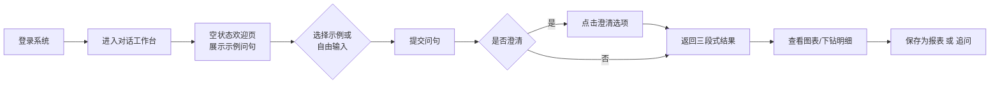
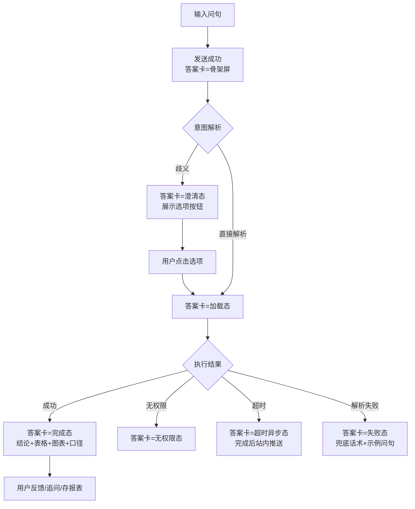
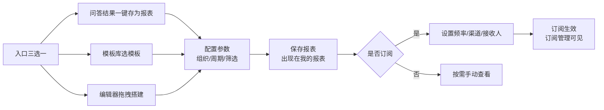
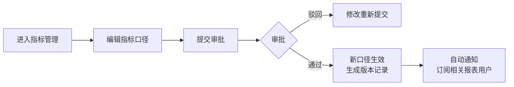
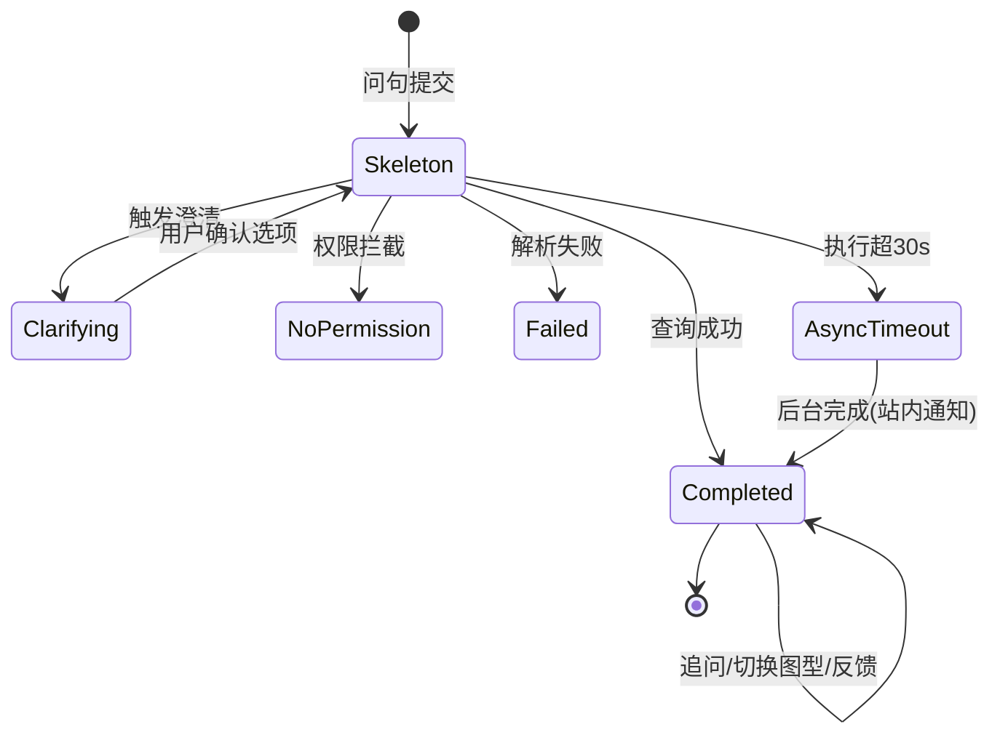
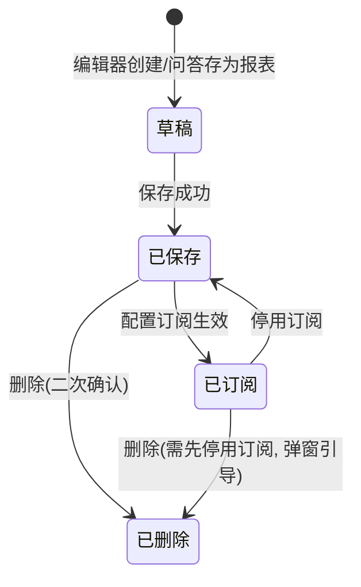
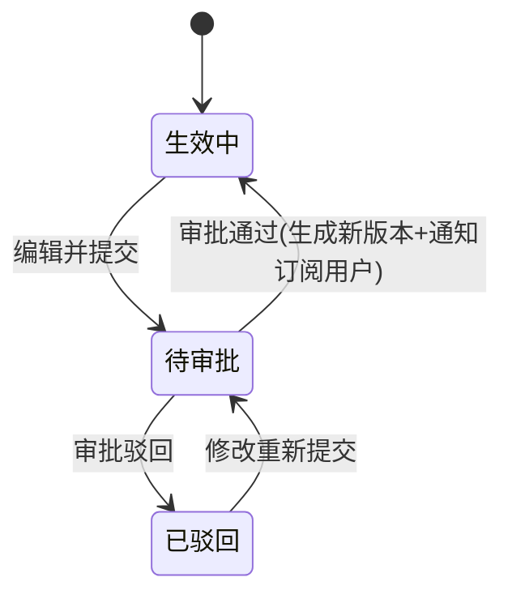

# HR智能问数 产品原型文档

| 文档属性 | 内容 |
|---|---|
| 产品名称 | HR智能问数（HR ChatBI） |
| 文档编号 | PROTO-HRCHATBI-001 |
| 版本号 | V1.0 |
| 文档状态 | 评审稿 |
| 关联文档 | 《产品需求文档PRD-HRCHATBI-001》《产品设计方案V1.0》 |
| 创建日期 | 2026-09-13 |
| 阅读对象 | UI/UX设计、前端开发、测试、产品 |
| 密级 | 内部 |

### 修订历史

| 版本 | 日期 | 修订人 | 修订说明 |
|---|---|---|---|
| V1.0 | 2026-09-13 | 产品部 | 基于PRD V1.0输出产品原型文档 |

---

## 目录

1. [设计原则与全局规范](#1-设计原则与全局规范)
2. [产品信息架构](#2-产品信息架构)
3. [用户流程图](#3-用户流程图)
4. [页面原型详细说明](#4-页面原型详细说明)
5. [核心组件与交互规范](#5-核心组件与交互规范)
6. [状态转换规则](#6-状态转换规则)
7. [响应式与适配规则](#7-响应式与适配规则)
8. [可用性要求](#8-可用性要求)
9. [原型验收清单](#9-原型验收清单)

---

## 1. 设计原则与全局规范

### 1.1 设计原则

1. **一致性**：所有模块遵循统一设计系统；页面布局、色彩、字体、组件尺寸、图标风格保持全局一致
2. **对话优先**：对话工作台是第一入口，问数路径不超过「输入→（可选澄清）→结果」3步
3. **可信透明**：每个数据答案必须可见数据口径与更新时间，关键操作可溯源
4. **安全感知**：无权限/脱敏状态在界面上明确、体面地表达，不暴露被过滤信息的存在
5. **降级不中断**：异常与降级状态有明确视觉表达，用户始终知道系统处于什么状态

### 1.2 全局视觉规范

#### 1.2.1 色彩规范

| 类别 | 色值 | 用途 |
|---|---|---|
| 主色 | #2563EB | 主按钮、链接、选中态、导航高亮 |
| 主色-悬浮 | #1D4ED8 | 主按钮hover |
| 辅助色 | #0EA5E9 | 图表次要系列、信息强调 |
| 成功 | #16A34A | 成功状态、达标指标 |
| 警告 | #F59E0B | 预警（如缺编率、离职率超阈值）、降级提示条 |
| 错误 | #DC2626 | 失败状态、无权限提示、点踩 |
| 页面背景 | #F5F7FA | 全局页面底色 |
| 卡片背景 | #FFFFFF | 卡片、面板、表格容器 |
| 分割线 | #E5E7EB | 边框、分隔 |
| 文字-主 | #111827 | 标题、正文强调 |
| 文字-次 | #6B7280 | 辅助说明、时间戳、口径说明 |
| 文字-禁用 | #9CA3AF | 禁用态 |
| 遮罩 | rgba(0,0,0,0.45) | 弹窗遮罩 |

> 图表分类色板（按序取用）：#2563EB / #0EA5E9 / #16A34A / #F59E0B / #DC2626 / #8B5CF6 / #14B8A6 / #EC4899

#### 1.2.2 字体与字阶

| 层级 | 字号/行高 | 字重 | 用途 |
|---|---|---|---|
| H1 | 24px/32px | 600 | 页面标题（如「报表中心」） |
| H2 | 20px/28px | 600 | 区块标题、数字卡主数值 |
| H3 | 16px/24px | 600 | 卡片标题、答案结论摘要 |
| 正文 | 14px/22px | 400 | 对话消息、表格内容、表单 |
| 辅助 | 13px/20px | 400 | 口径说明、时间戳、面包屑 |
| 说明 | 12px/18px | 400 | 标签、水印、图表轴刻度 |

- 字体族：`PingFang SC`, `Microsoft YaHei`, `-apple-system`, `sans-serif`
- 数字（指标值）建议使用等宽数字特性 `font-variant-numeric: tabular-nums`

#### 1.2.3 布局栅格与间距

| 项目 | 规格 |
|---|---|
| 栅格 | 24栏，栏间距16px |
| 页面边距 | 24px（左右上下） |
| 区块间距 | 16px（同一页面卡片间） |
| 卡片内边距 | 16px |
| 组件间距 | 8px（表单项内）、12px（按钮组） |

#### 1.2.4 组件尺寸规格

| 组件 | 规格 |
|---|---|
| 主按钮 | 高40px，圆角6px，内边距0 20px |
| 次按钮 | 高32px，圆角6px，内边距0 16px |
| 输入框 | 高36px，圆角6px；对话输入框例外（高48px，圆角8px） |
| 表格 | 行高44px，表头背景#F9FAFB，斑马纹可选 |
| 卡片 | 圆角8px，边框1px #E5E7EB，悬浮阴影 `0 2px 8px rgba(0,0,0,0.08)` |
| 弹窗 | 圆角12px，最小宽480px，居中，遮罩1.2.1规格 |
| 标签Tag | 高24px，圆角4px，内边距0 8px |
| 导航栏 | 顶部导航高56px；侧边导航宽240px |
| 图标 | 线性风格16px/20px两档，描边1.5px，与文字间距8px |

#### 1.2.5 交互反馈规范

| 场景 | 反馈方式 | 时长 |
|---|---|---|
| 提交问句 | 输入框禁用 + 答案区骨架屏 | 直至返回 |
| 操作成功（保存报表等） | 全局Toast（顶部居中，成功色） | 3s自动消失 |
| 操作失败 | 全局Toast（错误色）+ 可重试 | 5s自动消失 |
| 危险操作（删除报表） | 二次确认弹窗，主按钮为红色危险态 | — |
| 权限不足 | 页面内嵌空状态提示（不使用Toast） | — |
| 文案语气 | 简洁中性，如「您暂无薪酬数据的查看权限」，禁止技术报错原文直出 | — |

---

## 2. 产品信息架构

### 2.1 站点地图

```
HR智能问数
├── 对话工作台 /chat                        【全员，默认首页】
│   ├── 历史会话侧栏（搜索/置顶/删除）
│   ├── 对话主区（问答流、澄清、追问推荐）
│   └── 答案详情侧栏（表格全览/图表切换/口径/SQL）
├── 报表中心 /reports                       【全员】
│   ├── 我的报表 /reports/mine
│   ├── 模板库 /reports/templates
│   ├── 订阅管理 /reports/subscriptions
│   ├── 报表详情 /reports/:id
│   └── 自定义报表编辑器 /reports/editor     【需报表创建权限】
├── 管理后台 /admin                         【管理员角色可见】
│   ├── 语义层配置
│   │   ├── 指标管理 /admin/metrics
│   │   ├── 维度管理 /admin/dimensions
│   │   └── 同义词库 /admin/synonyms
│   ├── 数据源与同步监控 /admin/data-monitor
│   ├── 权限管理 /admin/permission
│   │   ├── 组织范围授权 / 行级
│   │   ├── 字段脱敏策略
│   │   └── 功能权限（明细/导出/订阅）
│   ├── 审计日志 /admin/audit
│   └── 问句评测 /admin/eval（标注问句集/回归报告/反馈队列）
└── 个人中心 /profile
    ├── 口径偏好（澄清默认选择记忆）
    └── 我的反馈记录
```

### 2.2 导航结构

| 导航 | 类型 | 可见性 | 说明 |
|---|---|---|---|
| 顶部导航栏 | 全局 | 全员 | Logo、主模块Tab（对话工作台/报表中心）、用户头像下拉（个人中心/退出） |
| 管理后台入口 | 顶部导航栏 | 仅管理员角色 | 「管理后台」Tab按角色动态显示 |
| 会话侧栏 | 页面级 | 对话工作台 | 可折叠，折叠后宽56px（仅图标） |
| 答案详情侧栏 | 页面级 | 对话工作台 | 默认展开360px，可折叠 |

### 2.3 角色与页面权限矩阵

| 页面 | HRBP/专员 | HRD | CHO | 管理员 | 数据管理员 |
|---|---|---|---|---|---|
| 对话工作台 | ✅ | ✅ | ✅ | ✅ | ✅ |
| 报表中心-查看/订阅 | ✅ | ✅ | ✅ | ✅ | ✅ |
| 报表编辑器 | ✅ | ✅ | ✅ | ✅ | ✅ |
| 导出/明细查看 | 授权制 | 授权制 | 授权制 | ✅ | ✅ |
| 语义层配置 | ❌ | ❌ | ❌ | ✅ | ✅ |
| 权限管理 | ❌ | ❌ | ❌ | ✅ | ❌ |
| 审计日志 | ❌ | ❌ | ❌ | ✅ | ✅（只读） |
| 数据源监控 | ❌ | ❌ | ❌ | ✅ | ✅ |

---

## 3. 用户流程图

### 3.1 首次使用流程（HRBP）



### 3.2 问数核心流程（含UI状态）



### 3.3 报表创建与订阅流程



### 3.4 管理员配置流程（口径变更）



---

## 4. 页面原型详细说明

> 布局图为示意线框（Wireframe），最终像素以设计稿为准；本文档中所有尺寸与交互规则为开发实现依据。

### 4.1 页面P1：对话工作台 /chat

#### 4.1.1 整体布局

```
┌────────────────────────────────────────────────────────────────────────┐
│ 顶部导航 56px: Logo | 对话工作台* | 报表中心 | (管理后台) |    头像▾      │
├───────────┬───────────────────────────────────────────┬────────────────┤
│ 会话侧栏   │  对话主区                                  │ 答案详情侧栏     │
│ 240px     │                                           │ 360px 可折叠    │
│┌─────────┐│ ┌─────────────────────────────────────┐   │┌──────────────┐│
││+ 新会话  ││ │ 问答卡片流（自上而下，新消息置底）      │   ││ Tab: 明细|图表|││
│└─────────┘│ │                                     │   ││      口径|SQL ││
│🔍 搜索会话 ││ │ [用户消息气泡-右侧]                    │   │├──────────────┤│
│───────────││ │ [系统答案卡-左侧, 宽≤720px]           │   ││ 当前答案明细   ││
│ 会话A (置顶)││ │  ┌ 结论摘要区                        │   ││ 表格(全字段)   ││
│ 会话B     ││ │  ├ 数据表格区                         │   ││ 支持排序/翻页  ││
│ 会话C     ││ │  ├ 图表区                            │   │├──────────────┤│
│ ...       ││ │  ├ 口径信息条                        │   ││ 口径详情/SQL   ││
│           ││ │  └ 操作条(反馈/存报表/导出)            │   ││ 数据更新时间   ││
│           ││ └─────────────────────────────────────┘   │└──────────────┘│
│           ││ ┌─────────────────────────────────────┐   │                │
│           ││ │ 对话输入框 48px  [📎][发送按钮40px]    │   │                │
│           ││ │ 播报: 数据仅含您有权限的范围           │   │                │
│           ││ └─────────────────────────────────────┘   │                │
└───────────┴───────────────────────────────────────────┴────────────────┘
```

#### 4.1.2 区块详细说明

**A. 会话侧栏（240px）**

| 元素 | 规格 | 交互 |
|---|---|---|
| 「+ 新会话」按钮 | 通栏，高40px，主色描边按钮 | 点击清空主区并进入空状态 |
| 搜索框 | 高32px，占位文案「搜索会话」 | 按会话标题与问句内容模糊搜索 |
| 会话项 | 高44px：标题(截断18字)+最近时间(12px辅助色) | 单击切换会话；hover显示「置顶/重命名/删除」图标；删除需二次确认 |
| 排序规则 | 置顶优先 → 按最近活跃时间倒序 | — |
| 折叠 | 侧栏顶部折叠按钮 | 折叠后56px图标栏，hover展开 |

**B. 空状态欢迎区（新会话默认）**

| 元素 | 说明 |
|---|---|
| 主文案 | H2「您好，我是HR数据助手」 |
| 副文案 | 正文-次「用一句话查询人力数据，如：上月入职了多少人？」 |
| 示例问句 | 6个可点击卡片（2列×3行），覆盖：日常查询/复杂条件/对比分析/报表生成；点击即填入输入框（不自动发送） |

**C. 对话输入框**

| 属性 | 规格 |
|---|---|
| 容器 | 高48px，圆角8px，聚焦时边框主色2px |
| 占位文案 | 「输入您的问题，Enter发送，Shift+Enter换行」 |
| 发送按钮 | 高40px主按钮「发送」；输入为空时禁用态 |
| 字数限制 | 500字，超出禁止发送并提示 |
| 发送后 | 输入框清空并保持聚焦；输入框上方展示上下文状态条（多轮时显示「已继承：时间=本月，组织=研发中心 ✕可移除」） |
| 底部播报 | 12px辅助色：「回答基于您有权限查看的数据范围」 |

**D. 问答卡片（系统答案）** —— 详见5.1核心组件

### 4.2 页面P2：报表中心 /reports

#### 4.2.1 整体布局

```
┌────────────────────────────────────────────────────────────────┐
│ 顶部导航 56px                                                   │
├────────────────────────────────────────────────────────────────┤
│ 页面标题区 H1「报表中心」  [新建报表]主按钮                        │
│ Tab: 我的报表* | 模板库 | 订阅管理                                │
├────────────────────────────────────────────────────────────────┤
│ 工具栏: 🔍搜索报表  ▾类型筛选  ▾排序(最近更新)                     │
├────────────────────────────────────────────────────────────────┤
│ 报表卡片网格 4列×N行 (卡片 288×200, 间距16px)                     │
│ ┌──────────────┐ ┌──────────────┐ ┌──────────────┐             │
│ │ 📊 缩略图区    │ │ 📊 缩略图区   │ │ 📊 缩略图区   │             │
│ │ 报表名称(H3)  │ │ 报表名称      │ │ 报表名称      │             │
│ │ 更新时间/订阅标 │ │ ...          │ │ ...          │             │
│ └──────────────┘ └──────────────┘ └──────────────┘             │
└────────────────────────────────────────────────────────────────┘
```

#### 4.2.2 区块详细说明

| 区块 | 规格 | 交互 |
|---|---|---|
| 报表卡片 | 288×200px；缩略图区160px（报表首图快照）；名称截断20字；底部13px辅助文字「更新于 2026-09-12 06:00」 | 单击进入报表详情；hover浮起阴影并显示「⋯」更多（编辑/订阅/删除） |
| 订阅标识 | 卡片右上角标签「已订阅」成功色Tag | — |
| 空状态 | 插画+「还没有报表」+「去模板库看看」次按钮 | — |
| 新建报表按钮 | 主按钮，权限受控（FR-19），无权限时隐藏 | — |

### 4.3 页面P3：报表详情 /reports/:id

```
┌──────────────────────────────────────────────────────────────┐
│ 面包屑: 报表中心 / 我的报表 / 部门人力成本月报                     │
├──────────────────────────────────────────────────────────────┤
│ 标题区: 报表名H1 + 口径标签   [编辑][订阅][导出][⋯]              │
├────────────┬─────────────────────────────────────────────────┤
│ 筛选器栏    │  图表区1 (高320px)                               │
│ 组织▾       │  ──────────────────────────────                 │
│ 周期▾       │  图表区2 (高320px)                               │
│ 自定义筛选▾ │  ──────────────────────────────                 │
│ [应用]      │  明细表格区（分页20条/页）                          │
├────────────┴─────────────────────────────────────────────────┤
│ 底部信息条: 数据更新时间 | 口径摘要 | 订阅状态                     │
└──────────────────────────────────────────────────────────────┘
```

**交互要点**：
- 筛选器变更后点击「应用」重新查询，数据区进入加载态（骨架屏）
- 「导出」受权限控制（BR-06），无权限时按钮隐藏；导出成功Toast+下载
- 「编辑」仅报表所有者与管理员可见
- 无权限访问时整页显示无权限空状态（见5.5）

### 4.4 页面P4：自定义报表编辑器 /reports/editor

```
┌──────────────────────────────────────────────────────────────┐
│ 工具栏: 报表名称输入 | [预览][保存]主按钮          [返回]        │
├──────────────┬──────────────────────────────┬────────────────┤
│ 字段面板      │        画布区                  │  属性面板       │
│ 240px        │                               │  280px         │
│ ▾指标(可多选) │ ┌─ 图表1 ─────────────┐       │  图表类型▾      │
│  在职人数     │ │   拖入字段后实时渲染   │       │  维度配置▾      │
│  离职率 ...  │ └─────────────────────┘       │  筛选器配置▾     │
│ ▾维度        │ ┌─ 明细表 ─────────────┐       │  图表联动开关    │
│  组织/时间... │ │   可添加明细表组件     │       │                │
│ (拖拽至画布)  │ └─────────────────────┘       │                │
└──────────────┴──────────────────────────────┴────────────────┘
```

**交互要点**：
- 字段仅展示用户有权限的指标/维度（前置过滤，无权限字段不显示）
- 字段拖入画布即渲染预览（查询超10s显示进度）
- 离开页面有未保存修改时二次确认「离开将丢失修改」
- 保存时校验：报表名称必填≤30字；至少一个组件

### 4.5 页面P5：管理后台 /admin（概要）

#### 4.5.1 整体布局

```
┌────────────────────────────────────────────────────────────────┐
│ 顶部导航（含管理后台标识）                                          │
├───────────┬─────────────────────────────────────────────────────┤
│ 左侧菜单   │  内容区                                              │
│ 200px     │  通用模式: 页面标题 + 工具栏(搜索/筛选/新增) + 数据表格  │
│ 语义层配置 ▾│  （指标/维度/同义词/权限/审计/评测均为 列表+表单 模式）  │
│ 数据源监控  │                                                     │
│ 权限管理   ▾│                                                     │
│ 审计日志    │                                                     │
│ 问句评测    │                                                     │
└───────────┴─────────────────────────────────────────────────────┘
```

#### 4.5.2 关键页面说明

| 页面 | 列表字段 | 关键操作 |
|---|---|---|
| 指标管理 | 指标名/主题域/口径摘要/状态(生效中/待审批/已驳回)/更新人/更新时间 | 新建/编辑（表单：名称、定义、公式、默认周期、可用维度、主题域）/提交审批/版本历史 |
| 维度管理 | 维度名/层级/枚举数/关联指标数 | 新建/编辑层级与枚举 |
| 同义词库 | 词条组/映射对象/命中次数 | 批量导入(Excel模板)/新增/启停用 |
| 数据源监控 | 数据源/任务/上次执行时间/状态Tag/延迟 | 立即重跑/查看失败日志 |
| 权限管理-组织范围 | 用户/用户组/可见组织范围/生效时间 | 新建授权（人员选择器+组织树勾选，含下级）/变更即时生效（BR-12） |
| 权限管理-字段脱敏 | 字段/默认策略/可见角色 | 编辑策略/申请明文授权流程配置 |
| 审计日志 | 时间/用户/问句或操作/敏感标记/导出文件 | 筛选（用户/时间/敏感操作）/导出审计报告 |
| 问句评测 | 问句/期望结果/最近回归结果(通过/失败)/来源(标注/点踩反馈) | 新增标注/批量导入/触发回归/查看准确率趋势图 |

### 4.6 页面P6：个人中心 /profile

| 区块 | 内容 | 交互 |
|---|---|---|
| 口径偏好 | 澄清问题历史默认选择（如「离职率默认口径=主动离职」） | 单选可改；说明文案「设置后同类问题将默认沿用」 |
| 我的反馈 | 点踩记录列表 + 处理状态（已修复/处理中） | 只读 |

---

## 5. 核心组件与交互规范

### 5.1 问答答案卡（AnswerCard）—— 全局核心组件

```
┌─────────────────────────────────────────────────────┐
│ 结论区                                                │
│   「上月入职128人，环比 +12%」（H3）                    │
├─────────────────────────────────────────────────────┤
│ 图表区 (高280px, 默认推荐图型, 右上角图型切换器)          │
├─────────────────────────────────────────────────────┤
│ 数据表格区 (默认展示前5行, 「查看全部20条」进入右侧详情)   │
├─────────────────────────────────────────────────────┤
│ 口径信息条 (12px辅助色):                                │
│   指标:入职人数 · 范围:全集团 · 时间:2026-08 ·          │
│   数据更新至 2026-09-12 06:00   [口径详情] [查看SQL]    │
├─────────────────────────────────────────────────────┤
│ 操作条: 👍 👎 | 存为报表 | 导出 | 追问推荐chips            │
│ 追问推荐: [按部门拆分] [和去年同期比] [看离职率]           │
└─────────────────────────────────────────────────────┘
```

| 元素 | 规格 | 交互 |
|---|---|---|
| 卡片容器 | 白底圆角8px，宽≤720px，左对齐；用户消息气泡主色底白字右对齐 | — |
| 图型切换器 | 图标按钮组：柱/线/饼/表 | 切换后会话内记忆选择（FR-07） |
| 表格区 | 仅展示维度+核心指标列；完整列进右侧详情侧栏 | 列头点击排序；组织维度行点击下钻（FR-08） |
| 追问推荐 | 圆角16px描边chips，最多3个 | 点击即作为新问题发送 |
| 存为报表 | 次按钮 | 点击弹窗命名→保存成功Toast→「去查看」链接 |
| 导出 | 次按钮，受权限控制 | 见BR-06；导出文件名规范：`{报表主题}_{组织}_{时间范围}_{导出人工号}.xlsx` |
| 反馈 | 👍/👎图标按钮 | 点踩弹出原因弹窗（必选单选：数据不对/图表不对/没听懂/其他+描述），提交成功Toast |

### 5.2 澄清卡（ClarifyCard）

```
┌─────────────────────────────────────────────────────┐
│ 💡 为了更准确地回答，请确认：                            │
│ 您想查看哪个时间范围的离职率？                            │
│ ( 单选 ) ○ 近30天   ○ 本季度   ○ 本年度                 │
│                                        [确认] 主按钮   │
└─────────────────────────────────────────────────────┘
```

- 触发规则按PRD FR-02；最多2问、5选项
- 确认后该卡片折叠为一行摘要：「已确认：时间=本年度」，新答案卡出现在下方
- 已确认选项记录入用户口径偏好（P6）

### 5.3 数字卡（MetricCard）

| 属性 | 规格 |
|---|---|
| 主数值 | H2 20px→大值场景28px，等宽数字 |
| 环比/同比 | 12px，上涨=成功色▲，下降=错误色▼（指标语义相反时反转：如离职率上升显示错误色，需按指标配置「优劣方向」） |
| 尺寸 | 200×96px，卡片规格同1.2.4 |

### 5.4 降级提示条（DegradeBanner）

- 位置：对话主区顶部通栏，高40px，警告色背景10%透明度+警告色文字
- 文案：「智能解析暂不可用，已为您返回预设查询，功能恢复后自动提示」
- 出现时机：AI服务异常期间所有页面（FR-24）；恢复后自动消失

### 5.5 空状态/异常态统一规范

| 状态 | 视觉 | 文案规范 |
|---|---|---|
| 加载中 | 骨架屏（答案卡）、表格行数×8 | — |
| 无权限 | 空状态插画（锁） | 主文案「您暂无{数据域}的查看权限」+ 次文案「请联系管理员开通」+ 管理员联系方式 |
| 无数据 | 空状态插画（空盒） | 「当前条件下暂无数据」+「调整筛选条件试试」 |
| 解析失败 | 空状态插画（对话气泡） | 「我还没理解您的问题」+ 3个示例问句 + [反馈问题]链接 |
| 查询超时 | 答案卡内异步态 | 「查询耗时较长，已转入后台执行，完成后将通知您」 |
| 系统错误 | 全局错误页 | 「服务开小差了，请稍后重试」+ [重试]按钮 |

---

## 6. 状态转换规则

### 6.1 答案卡状态机



| 状态 | 界面表现 | 可执行操作 |
|---|---|---|
| Skeleton骨架 | 骨架屏，输入框禁用 | 无（等待） |
| Clarifying澄清 | 澄清卡（5.2） | 选择选项、取消本次提问 |
| Completed完成 | 完整答案卡 | 反馈/存报表/导出/下钻/图型切换/追问 |
| NoPermission | 无权限空状态 | 联系管理员 |
| Failed | 失败空状态 | 重新表述/反馈 |
| AsyncTimeout | 异步态卡+loading图标 | 继续其他提问；完成时站内通知+卡片自动更新 |

### 6.2 会话状态

| 状态 | 进入条件 | 行为 |
|---|---|---|
| 活跃 | 有交互且<30分钟 | 上下文继承生效（BR-08） |
| 上下文过期 | 30分钟无交互 | 再提问时上下文条清空并轻提示「已开启新上下文」 |
| 已归档 | 手动删除前/超过90天不活跃 | 从列表移除（软删除，管理后台可恢复期内30天） |

### 6.3 报表与订阅状态



**订阅任务执行状态**：待执行 → 执行中 → 成功 / 失败（自动重试3次→仍失败标红并通知报表所有者）。

### 6.4 口径变更状态（指标管理）



规则：审批通过前线上查询一律使用旧口径（BR-04）；生效中状态下不允许并发编辑（编辑按钮置灰+「他人正在编辑」提示）。

### 6.5 数据同步任务状态

| 状态 | 判定 | 界面 |
|---|---|---|
| 运行中 | 任务执行中 | 蓝色Tag+转圈图标 |
| 成功 | 完成且质量校验通过 | 绿色Tag+完成时间 |
| 失败 | 执行异常或校验失败 | 红色Tag+失败原因（hover显示日志摘要）+「重跑」按钮 |
| 重试中 | 自动重试期间 | 警告色Tag+「第N/3次重试」 |
| 延迟 | 超过约定完成时间未成功 | 警告Tag；前端答案自动标注数据延迟（BR-09） |

---

## 7. 响应式与适配规则

| 断点 | 布局策略 |
|---|---|
| ≥1920px | 对话工作台三栏全展开；报表卡片5列 |
| 1440-1919px | 默认布局（按4.1）；报表卡片4列 |
| 1366-1439px | 答案详情侧栏默认折叠；报表卡片3列 |
| 1024-1365px | 会话侧栏默认折叠；报表卡片2列 |
| <1024px（H5/IM内嵌） | 仅对话工作台+报表查看（编辑器/管理后台不开放）；单栏堆叠；表格横向滚动 |

**固定规则**：
- 对话答案卡最大宽度始终720px，居中偏左
- 顶部导航与筛选器栏不参与横向滚动
- 表格最小列宽120px，超出容器横向滚动，首列冻结

---

## 8. 可用性要求

| 项目 | 要求 |
|---|---|
| 键盘可达性 | 对话框Enter发送/Shift+Enter换行；Tab顺序符合视觉流；澄清选项支持数字键1-5快捷选择 |
| 对比度 | 文字与背景对比度≥4.5:1（WCAG AA） |
| 加载感知 | >300ms操作必须有加载反馈；>10s必须有进度或异步提示 |
| 防误触 | 删除/停用订阅等危险操作二次确认；确认弹窗按钮文案具体化（「删除」而非「确定」） |
| 文案规范 | 统一使用「您」称呼；错误提示不含技术堆栈；数据为空不用「错误」表述 |
| 埋点 | 页面曝光、核心点击（发送/澄清选项/反馈/导出/存报表）全部埋点（对应PRD 6.6） |

---

## 9. 原型验收清单

> 供测试与产品验收逐条核对；与PRD第9章验收标准配合使用。

### 9.1 全局规范

| # | 验收项 | 通过标准 |
|---|---|---|
| G1 | 色彩/字体/间距符合1.2规范 | 抽查10个页面无偏差 |
| G2 | 组件尺寸符合1.2.4规格 | 按钮/输入框/表格抽查一致 |
| G3 | 各断点布局符合第7章 | 5个断点逐一验证 |
| G4 | 空状态/异常态文案符合5.5 | 全部状态触发验证 |

### 9.2 对话工作台

| # | 验收项 | 通过标准 |
|---|---|---|
| C1 | 问数全流程 | 3.2流程各状态完整流转，状态机6.1无遗漏 |
| C2 | 澄清交互 | 最多2问5选项；确认后折叠摘要；偏好记忆生效 |
| C3 | 多轮上下文 | 主题继承/条件修改/对比延伸三类问句正确；30分钟过期规则生效 |
| C4 | 答案卡 | 三段式完整；图型切换记忆；口径条必现；追问推荐可点击 |
| C5 | 下钻 | 组织行点击逐级下钻且越权数据不出现；面包屑可返回 |
| C6 | 导出 | 权限/行数/水印/文件名规则符合BR-06 |
| C7 | 降级 | 断AI服务后预设问句可查+降级提示条出现，恢复后自动消失 |

### 9.3 报表中心

| # | 验收项 | 通过标准 |
|---|---|---|
| R1 | 三个入口建报表 | 问答存报表/模板/编辑器均可用，状态机6.3正确 |
| R2 | 订阅推送 | 频率/渠道正确触发；失败重试3次并通知 |
| R3 | 转发权限 | 订阅链接被无权限用户打开时拒绝（BR-13） |

### 9.4 管理后台

| # | 验收项 | 通过标准 |
|---|---|---|
| A1 | 指标配置 | 新增指标保存后可被问数命中；口径变更走审批（6.4） |
| A2 | 权限管理 | 组织授权变更≤5分钟生效（BR-12）；脱敏策略全出口生效 |
| A3 | 审计 | 问句/导出/明文查看全量留痕，可按筛选检索 |
| A4 | 评测 | 标注集可导入、可触发回归、准确率趋势图正确 |

### 9.5 性能与安全（联动PRD 9.3/9.4）

| # | 验收项 | 通过标准 |
|---|---|---|
| S1 | 加载反馈 | 所有>300ms操作有加载态 |
| S2 | 响应时延 | 简单查询P95<3s；澄清响应<1.5s |
| S3 | 越权 | 构造URL/参数越权访问全部被拦截 |
