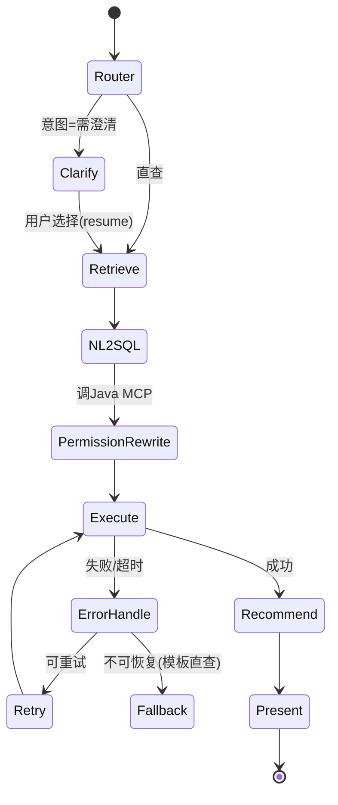
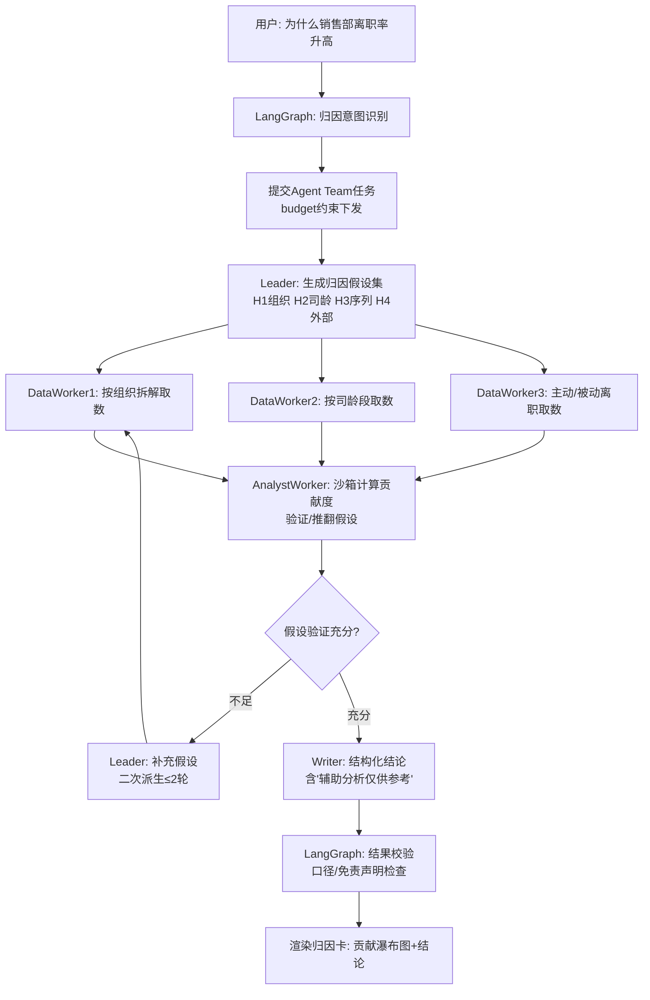

# HR智能问数 多智能体系统集成技术选型方案

| 文档属性 | 内容 |
|---|---|
| 产品名称 | HR智能问数（HR ChatBI） |
| 文档编号 | AGENT-HRCHATBI-001 |
| 版本号 | V1.0 |
| 文档状态 | 评审稿 |
| 关联文档 | 《技术选型文档TECH-HRCHATBI-001》《产品需求文档PRD-HRCHATBI-001》 |
| 创建日期 | 2026-09-13 |
| 作者 | 架构组 |
| 密级 | 内部 |

> **术语说明**：本方案中用户需求所述「scopeAgent」经调研确认为阿里巴巴 ModelScope 团队开源的多智能体框架 **AgentScope**（当前版本 2.0.x，Apache 2.0 协议）。若实际所指为其他框架，请评审时更正，本文选型逻辑可复用。

---

## 目录

1. [选型背景与现状分析](#1-选型背景与现状分析)
2. [多智能体能力需求分析](#2-多智能体能力需求分析)
3. [核心技术组件选型](#3-核心技术组件选型)
4. [与现有系统的集成方式](#4-与现有系统的集成方式)
5. [多智能体通信机制设计](#5-多智能体通信机制设计)
6. [任务分配与协作流程规划](#6-任务分配与协作流程规划)
7. [性能优化策略](#7-性能优化策略)
8. [中文语境特殊处理方案](#8-中文语境特殊处理方案)
9. [可行性分析](#9-可行性分析)
10. [实施步骤](#10-实施步骤)
11. [风险评估](#11-风险评估)
12. [附录](#12-附录)

---

## 1. 选型背景与现状分析

### 1.1 演进背景

依据《技术选型文档》E2演进规划（V2.0，+6个月），产品将引入**Agent编排能力**，支撑FR-11归因分析完整版及后续智能化场景。V1.0的AI链路为**固定流水线**（意图→NL2SQL→执行→渲染），无法满足：

- 归因分析需**多步推理**（假设→取数→验证→再取数），步骤数不可预知
- 复杂报表/洞察生成需**多角色协作**（规划、取数、分析、撰写）
- 澄清、确认等**人机协同点**需要可控的中断/恢复机制

### 1.2 现有技术栈盘点

| 层次 | 现状（TECH-HRCHATBI-001） | 对多智能体集成的影响 |
|---|---|---|
| AI编排 | Python 3.11 + LangChain（自研封装轻量链路） | LangGraph与LangChain同源，**零迁移成本升级** |
| 模型服务 | Qwen2.5-72B/14B + vLLM（OpenAI兼容API）+ ai-gateway分级路由 | 两框架均支持OpenAI兼容接入，直接复用 |
| 应用层 | Java 17 + Spring Boot 3（权限中心/语义层/审计） | Agent运行时必须**以服务形式被Java调用**，权限改写等能力通过工具回调复用 |
| 数据层 | Doris / MySQL / Redis / Kafka | Agent状态存储与消息通信直接复用 |
| 降级方案 | Redis问句模板直查（FR-24） | 多智能体链路必须**完整保留降级旁路** |
| 语义层 | 元数据驱动的NL2SQL模板拼装 | Agent取数工具统一走语义层，禁止裸SQL直连（BR-01/04） |

### 1.3 集成原则（架构红线）

1. **权限不旁路**：任何Agent的任何取数动作必须经Java权限中心改写，Agent侧不持有数据权限
2. **语义层唯一**：取数工具入参为语义层对象（指标/维度/筛选），不生成物理SQL
3. **降级可达**：多智能体链路故障时一键回退V1.0流水线
4. **可观测**：全链路Trace贯穿Java→LangGraph→AgentScope→vLLM
5. **私有化**：不引入数据出域的外部SaaS依赖

---

## 2. 多智能体能力需求分析

### 2.1 业务场景驱动的能力矩阵

| 场景（PRD映射） | 需要的Agent能力 | 关键特征 |
|---|---|---|
| 智能问数V2（FR-01增强） | 确定性流程编排 + 可控中断（澄清） | 状态机、可回放、低延迟 |
| 归因分析（FR-11） | 动态多步推理 + 并行取数验证 | 步骤不可预知、需反思重试 |
| 洞察报告生成（FR-14增强） | 多角色协作（规划/取数/分析/撰写） | 任务分解、结果汇总 |
| 异动预警解读（P2） | 事件触发式异步Agent | 后台执行、主动推送 |

### 2.2 能力需求汇总

| 能力域 | 需求点 |
|---|---|
| 编排 | 显式状态机（审计可回放）、条件分支、并行扇出、Human-in-the-loop中断恢复 |
| 协作 | 动态任务分解（Leader-Worker）、消息广播、并发Worker、结果聚合 |
| 记忆 | 会话短期记忆、跨会话偏好记忆、任务级工作记忆隔离 |
| 工具 | 统一工具注册、权限准入、沙箱执行（代码解释器）、超时熔断 |
| 可靠 | 节点级重试、检查点持久化、部分失败恢复、全链路幂等 |
| 运维 | 多租户会话隔离、Token计量、灰度发布、A/B评测 |

---

## 3. 核心技术组件选型

### 3.1 关键架构决策：双框架分工而非二选一

**结论：LangGraph承担「确定性流程骨架」，AgentScope承担「开放式协作执行」。**

| 对比维度 | LangGraph 1.x | AgentScope 2.0 | AutoGen | CrewAI | Dify |
|---|---|---|---|---|---|
| 定位 | 图状态机编排 | 多智能体平台 | 对话式多Agent | 角色扮演协作 | 低代码应用平台 |
| 确定性/可控性 | ★★★★★（显式State+边） | ★★★☆（事件驱动） | ★★ | ★★ | ★★★ |
| Human-in-the-loop | ★★★★★（interrupt原生） | ★★★☆（事件系统） | ★★★ | ★★ | ★★★ |
| 动态多Agent协作 | ★★★（可做但繁琐） | ★★★★★（Agent Team/MsgHub/Actor分布式） | ★★★★ | ★★★★ | ★★ |
| 检查点/回放 | ★★★★★（Checkpoint原生） | ★★★ | ★★ | ★ | ★★★ |
| 生产服务化 | 需自封装 | ★★★★★（内置FastAPI多租户/多会话服务） | 弱 | 弱 | ★★★★ |
| 与现有LangChain链路兼容 | ★★★★★（同源） | ★★★ | ★★★ | ★★ | ★★ |
| 私有化友好 | ★★★★★（纯库） | ★★★★★（纯库，沙箱可Docker本地） | ★★★★ | ★★★★ | ★★★ |

**分工依据**：
- 问数主链路是**高频、低延迟、强合规**场景，需要每一步可审计、可回放、可精确降级 → 状态机是最佳形态（LangGraph）
- 归因/洞察是**低频、长耗时、开放性**场景，需要动态分解与并行协作 → 消息驱动的Agent Team是最佳形态（AgentScope）
- 两框架能力重叠部分（记忆/模型接入）通过**统一适配层**收敛，避免双份维护

### 3.2 选型清单与依据

| 组件 | 选型 | 版本 | 选型依据 | License |
|---|---|---|---|---|
| 流程编排引擎 | **LangGraph** | 1.x | 与现有LangChain同源零迁移；interrupt/checkpoint原生支持；State可序列化满足审计回放 | MIT |
| 多智能体平台 | **AgentScope** | 2.0.x | Agent Team（Leader动态派生Worker）；Actor模型支持并发与分布式；内置生产级Agent Service（多租户/多会话/事件流）；事件系统可直通前端SSE；权限系统细粒度管控工具调用 | Apache 2.0 |
| 检查点存储 | LangGraph **PostgreSQL Saver**（Redis可作加速层） | — | 事务一致性优于Redis Saver；复用现有PostgreSQL(pgvector实例) | — |
| 会话/任务状态 | AgentScope Session（Redis）+ MySQL持久化 | — | 复用现有中间件 | — |
| 工具协议 | **MCP（Model Context Protocol）** + OpenAI Tool Calling | — | 工具统一注册中心；Java权限/语义层能力封装为MCP Server供双框架调用 | — |
| 沙箱执行 | AgentScope **Docker Sandbox**（E2B仅限云端版，不采用） | — | 归因分析中的统计计算需代码解释器；Docker沙箱满足私有化与隔离要求 | — |
| 可观测 | **Langfuse**（自托管）+ SkyWalking联动 | — | LLM调用/Agent轨迹可视化；自托管满足私有化红线；TraceID透传SkyWalking | MIT |
| 消息通信 | 进程内事件 + Kafka（跨服务/异步任务） | — | 复用现有Kafka；预警解读等异步场景走Kafka | — |

### 3.3 淘汰方案说明

| 淘汰项 | 原因 |
|---|---|
| 仅用LangGraph（自研Agent Team） | 动态协作/分布式并发需大量自研，重复造轮子，维护成本高 |
| 仅用AgentScope承担全部 | 问数主链路的事件驱动模型可控性弱于状态机，P95<3s与审计回放达标风险高 |
| AutoGen / CrewAI | 生产服务化能力弱（需大量自封装），且与现有LangChain链路无兼容优势 |
| Dify / Coze | 低代码平台与自研语义层/权限链路整合深度不足；SaaS形态违背私有化红线 |
| LangSmith（SaaS） | 数据出域风险；以自托管Langfuse替代 |

---

## 4. 与现有系统的集成方式

### 4.1 集成后目标架构

```
┌────────────────────── Java应用层（不变） ──────────────────────┐
│ chat-service │ report-service │ authz-service │ semantic-service│
└───────┬───────────────────────────────────────┬───────────────┘
        │ REST(同步) / SSE(流式) / Kafka(异步)     │ MCP Server(工具)
┌───────▼───────────────────────────────────────▼───────────────┐
│                  Python Agent运行时（新增，K8s独立部署）          │
│  ┌─────────────────────────────────────────────────────────┐  │
│  │ agent-gateway（FastAPI：鉴权透传/会话路由/SSE事件出栈）      │  │
│  └───────┬─────────────────────────────────────────────────┘  │
│  ┌───────▼──────────────┐   ┌─────────────────────────────────┐│
│  │ LangGraph 编排层      │   │ AgentScope 协作层                ││
│  │ ·问数主链路状态机      │──▶│ ·归因Agent Team(Leader+Workers) ││
│  │ ·澄清 interrupt       │   │ ·洞察报告Agent Team             ││
│  │ ·Checkpoint(PG)      │   │ ·Actor并发 / MsgHub             ││
│  └───────┬──────────────┘   └──────────┬──────────────────────┘│
│  ┌───────▼─────────────────────────────▼──────────────────────┐│
│  │ 统一适配层：ModelAdapter(接ai-gateway) │ ToolRegistry(MCP)  ││
│  │            MemoryAdapter(Redis/PG)    │ TraceAdapter(Langfuse)│
│  └───────────────────────────────────────────────────────────┘│
└───────────────────────────────────────────────────────────────┘
```

### 4.2 集成方式详述

| 集成点 | 方式 | 说明 |
|---|---|---|
| Java ↔ agent-gateway | REST（提交任务/查询状态）+ SSE（流式事件）+ Kafka（异步长任务） | 沿用V1.0 chat-service调用范式，Java侧新增`AgentClient`封装，接口契约OpenAPI 3 |
| LangGraph ↔ 现有LangChain链路 | **原地升级** | V1.0的意图识别/NL2SQL节点改造为LangGraph节点函数，Prompt与适配代码复用 |
| AgentScope Agent Team | 作为LangGraph的**子任务执行节点**被调用 | LangGraph归因节点通过内部gRPC/HTTP调用AgentScope Agent Service，任务级隔离，超时熔断 |
| 模型接入 | 双框架ModelAdapter统一指向**现有ai-gateway** | vLLM(OpenAI兼容)/14B-72B路由/降级链路对Agent透明；Token计量在gateway统一 |
| 权限与取数 | Java暴露MCP Server：`semantic_query`(语义查询)、`permission_check`、`report_save`等 | Agent工具入参=语义层对象；authz-service在MCP Server侧强制改写，Agent无法绕过（红线1/2） |
| 会话与身份 | Java签发的会话Token透传至agent-gateway，UserContext（组织权限范围）随任务下发 | Agent不查询权限，只携带已裁决的权限上下文 |
| 前端SSE | AgentScope事件流（TEXT_DELTA/TOOL_CALL/PLAN_UPDATE）→ agent-gateway标准化 → 现有SSE通道 | 前端新增「分析过程可视化」组件（计划步骤/工具调用进度） |
| 沙箱 | Docker沙箱Pod（K8s同集群，网络策略隔离，只读数据卷） | 代码解释器无外网访问，输出仅结构化结果 |

### 4.3 部署形态

| 组件 | 部署 | 资源 |
|---|---|---|
| agent-gateway + LangGraph runtime | K8s Deployment ×3副本（HPA按并发） | 4C8G/副本 |
| AgentScope Agent Service | K8s Deployment ×2副本 | 4C8G/副本 |
| Docker沙箱 Pod池 | 预热池10-20个，按需扩 | 1C1G/沙箱 |
| Langfuse | K8s（PG+ClickHouse存储） | 2C8G |

---

## 5. 多智能体通信机制设计

### 5.1 分层通信模型

```
L1 进程内：LangGraph State(共享状态通道) / AgentScope MsgHub(消息广播)
L2 框架间：LangGraph节点 ⇄ AgentScope Service（HTTP/gRPC，任务提交-事件回传）
L3 服务间：agent-gateway ⇄ Java服务（REST/SSE）+ Kafka（异步事件总线）
L4 前端向：SSE标准化事件流（单一出口）
```

### 5.2 L1：框架内部通信

| 框架 | 机制 | 设计规则 |
|---|---|---|
| LangGraph | TypedDict共享State + Channel reducer（如`messages`用append、`result`用last-write） | State字段白名单化（禁止自由扩展，保证可序列化与审计）；每节点声明读写集 |
| AgentScope | MsgHub广播（同组Agent互见）+ Agent Team领导-派生消息（私有点对点） | 归因Team内Worker间不直接互聊，统一经Leader裁决，防止对话爆炸；MsgHub消息上限100条/任务 |

### 5.3 L2：跨框架任务协议（核心自定义契约）

```json
// LangGraph → AgentScope 子任务请求
POST /agent-team/tasks
{
  "task_id": "uuid",
  "team_type": "attribution",        // attribution | insight_report
  "user_context": { "user_id": "...", "org_scope": [...], "field_policy": "v2" },
  "task_input": {
    "metric": "turnover_rate", "time_range": "2026-Q3",
    "anomaly": "+3.2pct", "baseline": "2026-Q2"
  },
  "budget": { "max_llm_calls": 20, "max_tools_calls": 30, "timeout_s": 120, "token_limit": 50000 },
  "callback": { "mode": "sse_stream", "events": ["PLAN_UPDATE","TOOL_CALL","TEXT_DELTA","FINAL"] }
}
```

**响应**：SSE事件流（JSON Lines），事件规范：

| 事件类型 | 载荷 | 前端表现 |
|---|---|---|
| PLAN_UPDATE | 计划步骤列表+状态 | 「分析计划」清单逐项打勾 |
| TOOL_CALL_START/END | 工具名/入参摘要/耗时/行数 | 「正在查询研发中心离职率…」进度 |
| TEXT_DELTA | 增量文本 | 流式撰写 |
| FINAL | 结构化结论（JSON Schema约束） | 结论卡渲染 |
| ERROR/RETRY | 错误码/重试次数 | 降级提示 |

### 5.4 通信可靠性设计

| 机制 | 实现 |
|---|---|
| 幂等 | task_id全局唯一；重复提交返回进行中/已完成结果 |
| 超时熔断 | L2任务级timeout（归因120s）+ L1节点级timeout；熔断后走降级链路 |
| 重试 | 幂等工具可重试（指数退避3次）；非幂等（存报表）仅Leader裁决后单次执行 |
| 背压 | Agent Team并发Worker上限5；全局任务队列（Redis Stream）限流，超出排队并前端提示 |
| 事件顺序 | 每事件带seq单调递增，前端乱序缓冲重排 |

---

## 6. 任务分配与协作流程规划

### 6.1 Agent角色清单

| Agent | 归属 | 职责 | 模型 |
|---|---|---|---|
| Router（意图路由） | LangGraph节点 | 问句分类：直查/澄清/归因/报表/闲聊 | 14B |
| Clarifier（澄清） | LangGraph interrupt | 生成澄清选项、记录偏好 | 14B |
| NL2SQL Agent | LangGraph节点 | 问句→语义层对象映射→模板SQL | 72B |
| Executor（执行） | LangGraph节点 | 调MCP取数、触发权限改写 | 无需LLM |
| Presenter（呈现） | LangGraph节点 | 结论摘要、图表推荐 | 14B |
| **Leader（归因规划）** | AgentScope Team | 分解归因假设、派生Worker、裁决汇总 | 72B |
| **DataWorker（取数）** | AgentScope Worker | 按假设调semantic_query取数 | 14B |
| **AnalystWorker（分析）** | AgentScope Worker | 沙箱统计计算（贡献度拆解）、验证假设 | 72B |
| **Writer（撰写）** | AgentScope Worker | 汇总生成归因结论（免责声明强制） | 72B |
| InsightLeader/ReportTeam | AgentScope Team | 洞察报告：大纲→分节取数→撰写→审校 | 72B/14B |

### 6.2 主链路一：智能问数（LangGraph状态机）



- **Checkpoint**：每节点后持久化PG，澄清中断可跨进程恢复（用户30分钟后回来继续）
- **人工介入**：Clarify用`interrupt()`实现，前端SSE收到`INTERRUPT`事件渲染澄清卡

### 6.3 主链路二：归因分析（LangGraph调度 + AgentScope协作）



**任务分配规则**：

| 规则 | 内容 |
|---|---|
| 并行度 | 同类Worker并行（fan-out），预算内max 5 |
| 收敛条件 | 假设覆盖率≥80%或达到2轮补查上限即收敛，防止无限循环 |
| 预算熔断 | max_llm_calls/max_tools_calls/token_limit任一触达 → 强制进入Writer汇总 |
| 失败降级 | Team失败 → LangGraph Fallback节点返回「已定位异常指标，归因服务繁忙」+ 基础对比图 |

### 6.4 主链路三：洞察报告（异步）

Kafka事件触发 → AgentScope ReportTeam后台执行（预计60-300s）→ 结果写MinIO快照 → 站内通知+IM推送。全程Langfuse留痕，人工审校节点（P2可选）。

---

## 7. 性能优化策略

### 7.1 延迟目标分解（问数主链路 P95<3s刚性约束）

| 环节 | 预算 | 优化手段 |
|---|---|---|
| 路由+澄清判断 | <500ms | 14B小模型 + KV Cache前缀复用（system prompt固定前缀命中vLLM prefix caching） |
| 语义检索 | <200ms | pgvector HNSW索引 + Redis缓存热点Schema |
| NL2SQL生成 | <1.2s | 72B流式输出；few-shot按域裁剪（Prompt≤3K tokens） |
| 权限改写+执行 | <800ms | V1.0既有能力不变；Doris物化视图 |
| 渲染首包 | <300ms | SSE先行推送结论占位，图表异步补齐 |
| **归因分析（异步豁免）** | <120s | 预算制+并行Worker+沙箱池预热 |

### 7.2 吞吐与资源优化

| 策略 | 说明 |
|---|---|
| 语义缓存 | 问句向量相似度≥0.95且权限上下文一致 → 直接返回缓存结果（TTL随数据同步周期）；预期命中率30-40%，等效降低LLM负载 |
| vLLM Continuous Batching | 双框架共享同一vLLM集群，批处理效率不因Agent化退化 |
| 并行扇出 | LangGraph `Send` API并行取数；AgentScope Actor并发Worker |
| Checkpoint异步写 | PG Saver异步刷盘，节点延迟零感知 |
| 沙箱池预热 | 常驻10个热沙箱，归因首次计算省2-3s冷启动 |
| 上下文裁剪 | MemoryAdapter滑动窗口：Team内部消息超20条自动摘要压缩（14B执行摘要，成本可控） |
| 分级降级梯度 | L1关Agent Team→L2关流式摘要→L3回退V1.0模板直查（FR-24），故障半径逐级收敛 |

### 7.3 容量规划

| 指标 | V2目标 | 依据 |
|---|---|---|
| 问数QPS | 100（不变） | 主链路Agent化零额外LLM调用（节点数与V1一致） |
| 归因并发 | 20并发任务 | 2×AgentScope副本 × 每任务5 Worker上限 |
| Token日消耗 | ≤8000万 | 语义缓存+预算制约束；gateway计量告警（超80%阈值） |

---

## 8. 中文语境特殊处理方案

### 8.1 中文理解层

| 问题 | 处理方案 | 落点 |
|---|---|---|
| HR黑话/缩写（HC、花名册、本薪） | 语义层同义词库（PRD 6.4）前置归一化；Router前增加**术语标准化节点** | LangGraph Retrieve前置 |
| 中文时间表达式（上季度/近半年/金三银四） | 规则库解析（覆盖200+中文时间模式）优先，失败回退14B解析；解析结果回显给用户确认 | 时间解析工具 |
| 全角/半角、繁简、中英混排（P6、P值） | 输入预清洗管道：NFKC归一化 + 繁简转换 + 中英边界空格规整 | agent-gateway入口统一 |
| 口语化模糊表述（「人少了好多」） | Router识别为归因意图而非字面查询；澄清卡引导量化 | Prompt工程+评测集覆盖 |
| 中文歧义（「研发部」同名多节点） | 既有澄清机制（FR-02），补充拼音匹配候选 | 语义检索层 |

### 8.2 中文生成层

| 问题 | 处理方案 |
|---|---|
| 数字与单位规范 | Presenter强制格式模板：数值千分位、百分比1位小数、「人/‰/%」单位表 |
| 结构化输出中文Json | Pydantic Schema约束 + `response_format=json_schema`（vLLM guided decoding），字段值中文 |
| 免责/合规话术 | Writer系统Prompt注入固定中文免责声明，LangGraph校验节点做包含性断言 |
| token效率 | Qwen原生中文tokenizer；上下文预算按**中文字符≈0.6 token**估算，Team消息裁剪阈值以字符计 |

### 8.3 中文评测体系

| 资产 | 内容 | 门禁 |
|---|---|---|
| 中文标注问句集 | 500条基础上扩充Agent场景至800条：含40条归因、30条口语模糊、30条时间表达边界 | 回归准确率≥90%；归因子集≥80% |
| Badcase回流 | 点踩+归因失败样本周级入库，按中文错误类型打标（术语/时间/口径/推理） | 每类Top3错误纳入下轮优化 |
| 中文Prompt回归 | Prompt模板变更强制跑中文评测集，禁止英文集替代 | CI门禁 |

---

## 9. 可行性分析

### 9.1 技术可行性

| 评估项 | 结论 | 依据 |
|---|---|---|
| 与现有栈兼容 | **高** | LangGraph与LangChain同源原地升级；AgentScope支持OpenAI兼容模型与自定义Tool，均指向现有ai-gateway；双框架均为纯Python库，K8s私有化无障碍 |
| 性能达标 | **中高** | 主链路节点数不增（Agent化不改问数路径），延迟风险集中在归因（异步豁免）；语义缓存进一步摊薄负载 |
| 权限合规 | **高** | 取数唯一入口为Java MCP Server，权限改写前置；Agent无独立数据通道；沙箱断网 |
| 双框架复杂度 | **中** | 需通过统一适配层收敛重叠能力（模型/记忆/Trace），边界清晰则维护成本可控（见11章风险R1） |

### 9.2 非技术可行性

| 维度 | 评估 |
|---|---|
| 团队技能 | Python工程师已具LangChain经验，LangGraph学习成本低（≈1周）；AgentScope 2.0文档完备（docs.agentscope.io），估2周上手；需1人专责框架边界守护 |
| 生态与版本 | 两框架均活跃迭代（AgentScope 2.0为2026年主推版本）；Apache 2.0/MIT协议商用无风险 |
| 成本增量 | 新增容器资源≈4台4C8G+沙箱池；LLM成本靠预算制与缓存约束在既有8000万token/日盘子内；无License费用 |
| 时间 | 6周集成（见10章），落在PRD V2.0窗口内，不阻塞V1.0交付 |

### 9.3 关键取舍记录

| 决策 | 备选 | 取舍理由 |
|---|---|---|
| 双框架分工 | 单LangGraph自研Team / 单AgentScope全包 | 主链路可控性与审计刚性 > 栈简洁性；归因协作不自研重复造轮 |
| MCP工具协议 | 直接REST工具 | MCP提供统一注册/发现/鉴权扩展点，未来多域Agent复用 |
| PostgreSQL Checkpoint | Redis Checkpoint | 澄清中断跨30分钟恢复需持久可靠性；PG实例已存在 |
| Docker沙箱 | E2B云沙箱 | E2B为外部SaaS，违背数据不出域红线 |

---

## 10. 实施步骤

| 阶段 | 周期 | 内容 | 交付/门禁 |
|---|---|---|---|
| S1 环境与骨架 | 第1周 | agent-gateway/Langfuse/沙箱池部署；LangGraph骨架（Router→NL2SQL→Execute→Present）迁移现有链路 | 问数主链路回归通过V1.0基线（500问句集≥90%） |
| S2 中断与检查点 | 第2周 | Clarify interrupt + PG Checkpoint + 跨会话恢复 | 澄清-恢复场景E2E通过；Checkpoint故障演练 |
| S3 工具层与MCP | 第3周 | Java MCP Server（semantic_query/permission_check/report_save）；AgentScope接入ai-gateway | 越权用例100%拦截；工具P95<800ms |
| S4 Agent Team（归因） | 第4-5周 | 归因Team（Leader/3类Worker/Writer）+ 预算熔断 + 前端分析过程组件 | 40条归因标注集准确率≥80%；120s预算内收敛率≥95% |
| S5 异步与通知 | 第6周 | 洞察报告Kafka链路 + MinIO快照 + IM推送 | 异步任务端到端成功率≥99% |
| S6 压测与灰度 | 第7周 | 100QPS问数+20并发归因压测；双框架混沌演练（杀副本/断PG/断vLLM）；灰度10%→50%→100% | 压测达标（7.1预算表）；降级梯度演练全通过 |

**灰度与回滚**：LangGraph与AgentScope链路以**功能开关**（按用户/问句类型路由）灰度；任何阶段可一键回退V1.0流水线（代码同仓共存，非部署级回滚）。

---

## 11. 风险评估

| 编号 | 风险 | 概率 | 影响 | 应对 |
|---|---|---|---|---|
| R1 | 双框架能力重叠导致重复建设与状态不一致 | 中 | 高 | 统一适配层强制收口（模型/记忆/Trace三通道）；架构评审卡点：禁止绕过适配层直连；明确边界文档化 |
| R2 | AgentScope 2.0迭代快，API breaking change | 中 | 中 | 版本锁定+月度升级窗口；适配层隔离框架API；升级强制跑800条回归集 |
| R3 | 归因结论质量不稳定（幻觉/过度归因） | 中 | 高 | Writer输出强制结构化Schema+引用取数证据；LangGraph校验节点断言免责声明与口径；归因结论标注置信度；准确率<80%时功能降级为「数据对比展示」 |
| R4 | 预算制失效导致token成本失控 | 低 | 中 | gateway硬限流（task级token熔断）+日消耗告警（80%）+缓存命中率周报 |
| R5 | 澄清中断跨进程恢复状态丢失 | 低 | 高 | PG Checkpoint事务写入+恢复演练纳入S6混沌用例；恢复失败兜底重新提问 |
| R6 | 沙箱逃逸/资源耗尽 | 低 | 极高 | Docker无外网+只读卷+CPU/内存/时长三重限额；代码白名单库（pandas/numpy）；输出结构化剥离执行代码 |
| R7 | Java-Python双栈联调效率低 | 中 | 中 | OpenAPI契约先行+契约测试（Pact）进CI；TraceID全链路贯通定位提速 |
| R8 | 双框架学习曲线拖慢进度 | 中 | 中 | S1阶段 pairing + 内部workshop；框架边界守护人机制；复杂度高的Team模式后置到S4（前置链路先稳） |

---

## 12. 附录

### 12.1 名词解释

| 术语 | 说明 |
|---|---|
| LangGraph State | 图执行过程中节点间共享的强类型状态对象，每节点声明读写范围 |
| interrupt（LangGraph） | 图执行的原生中断机制，等待人工输入后从断点恢复，配合Checkpoint实现跨会话恢复 |
| Agent Team（AgentScope） | Leader Agent动态派生Worker并协调的协作模式（2.0内置） |
| MsgHub | AgentScope消息广播中心，组内Agent互发消息的通信原语 |
| MCP | Model Context Protocol，工具/资源标准化接入协议，本方案用于Java能力暴露 |
| 预算制（Budget） | 对单次Agent任务的LLM调用次数/工具调用次数/Token总量/时长的硬约束 |
| 语义缓存 | 以问句向量相似度+权限上下文为键的结果缓存，规避重复LLM推理 |

### 12.2 参考

- AgentScope 官方仓库与文档：github.com/agentscope-ai/agentscope ｜ docs.agentscope.io
- LangGraph 官方文档：langchain-ai.github.io/langgraph
- MCP 规范：modelcontextprotocol.io
- 内部文档：《技术选型文档》《产品需求文档PRD》《产品原型文档》

### 12.3 待确认事项

| 编号 | 事项 | 责任方 | 截止 |
|---|---|---|---|
| Q1 | 「scopeAgent」如非指AgentScope请澄清 | 需求方 | S1前 |
| Q2 | 归因结果是否允许展示中间假设过程（影响前端组件） | 产品 | S4前 |
| Q3 | 沙箱统计计算是否需接入更多数据科学库（影响镜像体积） | 算法 | S3前 |
