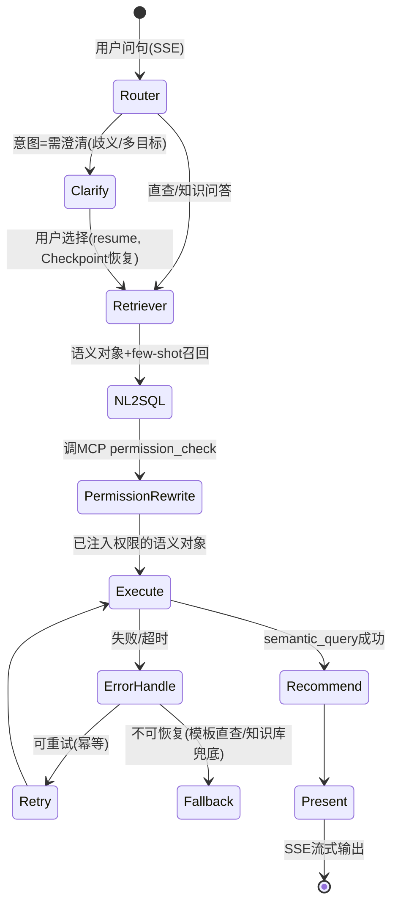
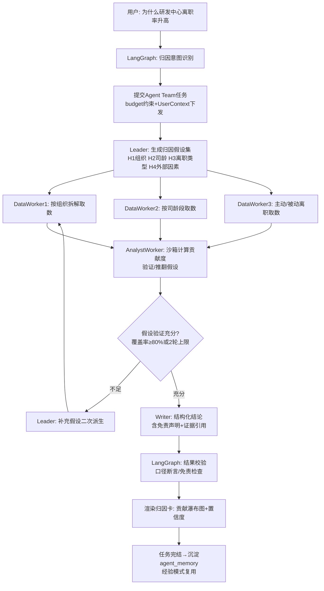

# HR智能问数 技术架构优化设计方案（Milvus核心知识库 + 多智能体）

| 文档属性 | 内容 |
|---|---|
| 产品名称 | HR智能问数（HR ChatBI） |
| 文档编号 | ARCH-HRCHATBI-002 |
| 版本号 | V2.0 |
| 文档状态 | 评审稿 |
| 架构描述标准 | ISO/IEC/IEEE 42010（系统与软件工程—架构描述） |
| 关联文档 | 《产品需求文档PRD-HRCHATBI-001》《技术选型文档TECH-HRCHATBI-001》《多智能体集成技术选型方案AGENT-HRCHATBI-001》《应用架构设计文档ARCH-HRCHATBI-001》《业务架构设计文档》《数据库设计文档》《接口设计文档》 |
| 创建日期 | 2026-09-28 |
| 作者 | 架构组 |
| 密级 | 内部 |

### 修订历史

| 版本 | 日期 | 修订人 | 修订说明 |
|---|---|---|---|
| V1.0 | 2026-09-13 | 架构组 | 应用架构设计文档（pgvector为向量存储、Milvus列为演进项） |
| V2.0 | 2026-09-28 | 架构组 | 技术选型优化：Milvus升级为核心知识库存储；正式采用LangGraph+AgentScope双框架多智能体架构；明确组件定位、接口、数据流、性能与安全设计 |

---

## 目录

1. [设计目标与优化范围](#1-设计目标与优化范围)
2. [选型优化决策总览](#2-选型优化决策总览)
3. [总体技术架构与组件功能定位](#3-总体技术架构与组件功能定位)
4. [Milvus核心知识库设计](#4-milvus核心知识库设计)
5. [多智能体框架设计（LangGraph + AgentScope）](#5-多智能体框架设计langgraph--agentscope)
6. [组件间接口定义](#6-组件间接口定义)
7. [数据处理流程](#7-数据处理流程)
8. [性能优化策略](#8-性能优化策略)
9. [可扩展性设计](#9-可扩展性设计)
10. [可维护性设计](#10-可维护性设计)
11. [安全性设计](#11-安全性设计)
12. [部署架构](#12-部署架构)
13. [架构决策记录（ADR）](#13-架构决策记录adr)
14. [实施路径](#14-实施路径)
15. [风险评估与应对](#15-风险评估与应对)
16. [附录](#16-附录)

---

## 1. 设计目标与优化范围

### 1.1 设计目标

在V1.0技术方案（TECH-HRCHATBI-001）与多智能体集成方案（AGENT-HRCHATBI-001）基础上，本方案完成两轮核心优化：

| 目标 | 说明 | 关键收益 |
|---|---|---|
| G1 Milvus核心化 | 将向量知识库从pgvector演进为**Milvus核心知识库**，承载语义层、问句语料、知识文档、智能体记忆等全部AI侧知识资产 | 多向量混合检索（稠密+稀疏+标量过滤）、水平扩展、GPU加速，支撑年10倍数据增长 |
| G2 多智能体正式落地 | 采用**LangGraph（确定性编排）+ AgentScope（开放式协作）**双框架，替代V1.0固定流水线 | 问数主链路可审计可回放，归因/洞察等开放式场景具备动态协作与Human-in-the-loop能力 |
| G3 全要素设计完备 | 明确各组件功能定位、交互流程、数据流转、接口契约、性能预算与安全红线 | 满足PRD 8.1性能指标（P95<3s/100QPS/99.9%可用性）与合规要求 |

### 1.2 优化范围界定

| 范围 | 内容 |
|---|---|
| 变更（本方案） | 向量存储pgvector→Milvus；语义层数据主存储迁入Milvus知识库；AI编排从LangChain轻量链路升级为LangGraph+AgentScope双框架；新增知识库构建管道、多向量检索服务、智能体记忆体系 |
| 不变（沿用V1.0） | Java应用层模块划分与权限体系（authz-svc/语义层/审计）；Doris数仓；vLLM+Qwen模型服务与分级路由；SSE流式通道；K8s私有化交付；三级降级梯度 |

### 1.3 架构红线（本方案强制约束）

1. **权限不旁路**：任何Agent/检索请求的数据访问必须经Java侧权限中心裁决，Milvus侧不持有业务数据权限，仅接受已注入权限上下文的检索
2. **知识库单一事实源**：语义层对象（指标/维度/口径/同义词）以Milvus知识库为主存储，MySQL仅保留版本审批流与审计事务
3. **降级可达**：Milvus故障时问数链路回退模板直查（FR-24），多智能体链路回退V1.0流水线
4. **数据不出域**：全部组件（含Milvus、向量模型、Langfuse）私有化部署，外部API兜底仅接触Schema
5. **可观测**：TraceID贯穿 Java→agent-gateway→LangGraph/AgentScope→Milvus→Doris

---

## 2. 选型优化决策总览

### 2.1 决策变更清单（相对V1.0）

| 编号 | 决策项 | V1.0（TECH-001） | V2.0（本方案） | 变更理由 |
|---|---|---|---|---|
| C-1 | 向量存储 | pgvector（PostgreSQL16），Milvus列为>50万演进项 | **Milvus 2.5（核心知识库）**，V1.0直接落地 | 知识库承载语义层/语料/文档/记忆多类数据，需多向量（稠密+稀疏）混合检索、动态Schema、GPU索引与水平扩展；pgvector仅单一稠密检索，且与PG主库耦合影响稳定性 |
| C-2 | 语义层主存储 | MySQL元数据表 | **MySQL（版本/审批/审计）+ Milvus（语义对象向量化主存储）** | 语义检索是NL2SQL准确率瓶颈，向量化后支持同义词模糊召回与Schema Linking增强；MySQL保留事务性审批流 |
| C-3 | AI编排 | LangChain轻量封装固定流水线 | **LangGraph（问数状态机）+ AgentScope（归因/洞察协作）** | AGENT-HRCHATBI-001已决策双框架分工，本方案细化运行时与接口 |
| C-4 | 知识检索能力 | 仅稠密向量TopK召回 | **多向量混合检索（稠密BGE-M3 + 稀疏BM25/SPLADE + 标量过滤）+ 重排（BGE-reranker）** | 中文术语/同义/缩写混合场景下，纯稠密检索召回率不足，混合+重排显著提升Schema Linking准确率 |
| C-5 | 智能体记忆 | 会话上下文（Redis临时） | **会话记忆（Redis）+ 任务记忆（Milvus集合）+ 跨会话偏好记忆（Milvus）** | 归因/洞察多轮任务需要跨会话知识沉淀与经验复用 |
| C-6 | 缓存体系 | Redis问句模板缓存 | **Redis（热点）+ Milvus语义缓存集合（向量相似度命中≥0.95）** | 语义缓存向量化后命中率提升（预期≥40%），等效降低LLM负载 |
| C-7 | 推理服务 | 纯CPU索引 | **Milvus GPU索引（CAGRA/IVF_PQ）可选启用** | 检索P95<50ms的刚性预算下，GPU索引摊薄CPU资源占用 |

### 2.2 保持不变的选型（承继V1.0结论）

| 层 | 技术 | 角色 |
|---|---|---|
| 前端 | **Vue 3 + TS + Vite + Ant Design Vue 4 + ECharts 5 + Pinia**（ADR-108） | 交互层SPA |
| 应用层 | Java 17 + Spring Boot 3.x 模块化单体 | 权限/语义/审计/报表 |
| 模型服务 | Qwen2.5-72B/14B + vLLM（自托管）+ ai-gateway分级路由 | NL2SQL/意图/摘要 |
| OLAP | Apache Doris 2.1+ | HR数仓分析 |
| 数据集成 | DataX + Flink CDC + Kafka | 数据管道 |
| 部署 | Kubernetes + Helm 私有化 | 交付形态 |

---

## 3. 总体技术架构与组件功能定位

### 3.1 总体架构图

```
┌─────────────────────────── 交互层 ───────────────────────────┐
│  React SPA(对话工作台/报表中心/管理后台)  │  IM机器人(H5只读)   │
├─────────────────────────── 接入层 ───────────────────────────┤
│  APISIX网关: OIDC鉴权 │ 限流 │ 灰度 │ SSE透传 │ 审计埋点      │
├───────────────────┬─────────────────────┬───────────────────┤
│ Java应用层          │     AI运行时(Python) │     AI专用服务    │
│ (模块化单体)         │                    │                   │
│ chat-service       │ agent-gateway       │  knowledge-svc   │
│ report/subscription│  (FastAPI: 会话路由/ │  (向量检索/索引/  │
│ semantic-service   │   事件标准化/SSE)    │   知识库管理API)  │
│ authz-service      │ ┌─────────────────┐ │                   │
│  (权限改写/MCP Server)│ │ LangGraph编排层  ││    embedding-svc  │
│ query-exec(SQL白名单)│ │ 问数状态机/澄清   ││  (BGE-M3多向量)   │
│ audit-service      │ │ Checkpoint/降级   ││    rerank-svc    │
│ admin-service      │ └───────┬─────────┘│  (BGE-reranker)   │
│                    │ ┌───────▼─────────┐│                   │
│                    │ │ AgentScope协作层 ││                   │
│                    │ │ 归因Team/报告Team ││                   │
│                    │ │ 沙箱调度/预算熔断  ││                   │
│                    │ └───────┬─────────┘│                   │
│                    │ ┌───────▼─────────┐│                   │
│                    │ │ 统一适配层         ││                   │
│                    │ │ Model/Tool(MCP)  ││                   │
│                    │ │ Memory/Trace     ││                   │
│                    │ └─────────────────┘│                   │
├───────────────────┴─────────┬───────────┴───────────────────┤
│                    Milvus核心知识库（数据核心）                │
│  semantic_meta │ qa_corpus │ doc_knowledge │ agent_memory    │
│  query_cache │ feedback        [多集合×分区键×多向量字段]      │
├──────────────────────────────┬──────────────────────────────┤
│ Doris(OLAP数仓) │ MySQL(元数据/审批) │ Redis(会话/热点缓存)     │
│ Kafka(事件) │ MinIO(快照/文件/索引持久化) │ ES(审计检索,可选)    │
├──────────────────────────────┴──────────────────────────────┤
│ 基础设施: K8s │ vLLM GPU池 │ Prometheus/Grafana/SkyWalking/ELK │
│           Langfuse │ Milvus Operator(集群运维)                  │
└─────────────────────────────────────────────────────────────┘
```

### 3.2 组件功能定位清单

| 组件 | 层次 | 功能定位 | 关键不职责 |
|---|---|---|---|
| APISIX网关 | 接入 | 认证前置、限流熔断、灰度路由、SSE透传 | 不做细粒度业务鉴权 |
| chat-service | Java应用 | 会话管理、问答请求编排（调用agent-gateway）、上下文管理、反馈收集 | 不执行SQL |
| semantic-service | Java应用 | 语义层对象配置化、版本与审批流、热更新；与Milvus知识库同步 | 不做物理SQL拼装 |
| authz-service | Java应用 | RBAC×行级×字段级三层权限、SQL改写、暴露MCP Server（semantic_query/permission_check） | 不缓存跨用户权限结果 |
| query-exec | Java应用 | 只读SQL白名单校验、Doris执行、超时控制 | 禁止写操作 |
| audit-service | Java应用 | 审计事件收集/存储/检索（≥3年） | — |
| agent-gateway | AI运行时 | Agent统一入口：会话路由、UserContext透传、SSE事件标准化、任务提交/状态查询 | 不做权限裁决 |
| LangGraph编排层 | AI运行时 | 问数主链路状态机（Router→澄清→检索→NL2SQL→执行→呈现）、interrupt/HITL、Checkpoint持久化、降级梯度 | 不直连Doris/Milvus业务库 |
| AgentScope协作层 | AI运行时 | 归因/洞察Agent Team（Leader-Worker）、Actor并发、MsgHub通信、Docker沙箱、预算熔断 | 不做权限裁决 |
| 统一适配层 | AI运行时 | ModelAdapter（接ai-gateway）、ToolRegistry（MCP客户端）、MemoryAdapter（Redis/Milvus）、TraceAdapter（Langfuse） | 禁止绕过适配层直连框架API |
| knowledge-svc | AI专用服务 | Milvus知识库统一入口：多向量检索编排（稠密+稀疏+重排+过滤）、集合/分区/索引管理、写入管道编排 | 不做权限裁决（接受已注入上下文） |
| embedding-svc | AI专用服务 | 文本→多向量（BGE-M3稠密+稀疏）批量/在线向量化 | — |
| rerank-svc | AI专用服务 | 检索结果精排（BGE-reranker-v2-m3），TopK 20→TopK 5 | — |
| Milvus集群 | 数据核心 | 知识库数据存储与向量检索（见§4） | 不承载业务事务 |

### 3.3 依赖规则

| 规则 | 内容 |
|---|---|
| D-1 | 应用层模块间禁止直访问对方数据库（ArchUnit守护） |
| D-2 | AI运行时禁止直连Doris/MySQL；取数唯一入口=MCP（permission_check→semantic_query） |
| D-3 | AI运行时访问Milvus唯一入口=knowledge-svc（KnowledgeClient），禁止LangGraph/AgentScope直接pymilvus |
| D-4 | AI运行时内部：LangGraph→AgentScope单向调用，禁止反向 |
| D-5 | 客户端禁止直连任何数据服务 |
| D-6 | knowledge-svc/embedding-svc无业务权限逻辑，仅作为受信数据平面 |

---

## 4. Milvus核心知识库设计

### 4.1 设计定位

Milvus 2.5作为**AI侧数据的核心存储**，统一承载五类知识资产，替代原pgvector并承接语义层主存储职责：

```
┌───────────────────── Milvus核心知识库 ─────────────────────┐
│                                                            │
│  ● semantic_meta   语义层对象库（指标/维度/同义词/口径/    │
│                    维度枚举）→ Schema Linking 与 NL2SQL    │
│  ● qa_corpus       问句语料库（历史问句/标注示例/few-shot   │
│                    模板/badcase）→ 语义缓存与示例召回        │
│  ● doc_knowledge   知识文档库（HR制度/口径说明/FAQ分块）     │
│                    → RAG检索增强（FR-01知识增强）           │
│  ● agent_memory    智能体记忆库（任务摘要/跨会话偏好/        │
│                    归因经验模式）→ 多智能体记忆复用         │
│  ● query_cache     语义缓存（问句向量→结果摘要）→ 降级直查  │
│  ● feedback        反馈库（点踩/纠错样本）→ 评测与badcase回流│
│                                                            │
│  存储特征: 多集合 │ 分区键(domain+tenant) │ 多向量字段       │
│            (稠密BGE-M3 + 稀疏SPLADE/BM25) │ 标量字段过滤     │
└────────────────────────────────────────────────────────────┘
```

### 4.2 数据模型设计

#### 4.2.1 集合 Schema 规范（多向量 + 标量）

统一Schema范式（以semantic_meta为例）：

| 字段 | 类型 | 说明 |
|---|---|---|
| pk | VARCHAR(64) | 主键 = `{domain}:{type}:{code}`，如 `hr:metric:turnover_rate` |
| domain | VARCHAR(32) | 主题域（hr/finance/sales…），**分区键（Partition Key）** |
| tenant_id | VARCHAR(32) | 租户（SaaS演进预留），分区键组合 |
| type | VARCHAR(32) | metric/dimension/synonym/doc/chunk/example/… |
| code | VARCHAR(64) | 对象编码 |
| name / aliases | VARCHAR / JSON | 名称与别名（同义词归一化前置） |
| content | VARCHAR(2048) | 检索文本（名称+别名+口径摘要拼接，供向量化） |
| dense_vec | FLOAT_VECTOR(1024) | BGE-M3稠密向量 |
| sparse_vec | SPARSE_FLOAT_VECTOR | SPLADE稀疏向量（BM25备选） |
| version | INT64 | 语义层版本号（查询侧按版本加载，旧请求不打断） |
| status | VARCHAR(16) | draft/published/archived |
| perm_level | INT64 | 数据密级（L1公开~L3敏感），检索前置过滤 |
| owner / updated_ts | 标量 | 治理元信息 |

**多向量配置**：Milvus 2.5支持一个集合多个向量字段（multi-vector），`dense_vec`+`sparse_vec`构成混合检索对，语义对象用`WeightedQuery`/RRF融合。

#### 4.2.2 六类集合与检索用途

| 集合 | 分区键 | 向量字段 | 检索用途 | 数据来源 |
|---|---|---|---|---|
| semantic_meta | domain+tenant | dense+sparse | Schema Linking：问句→相关指标/维度召回 | semantic-service发布事件 |
| qa_corpus | domain+tenant+type | dense+sparse | 语义缓存命中判定；few-shot示例召回；模板匹配降级 | 会话记录/标注平台/feedback |
| doc_knowledge | domain+tenant | dense+sparse | RAG知识增强：口径/制度问答 | 文档导入管道 |
| agent_memory | tenant+task_type | dense | 智能体经验复用：相似任务既往方案 | 归因/洞察任务完结沉淀 |
| query_cache | domain+tenant | dense | 问句向量→结果摘要（相似≥0.95直接返回） | 问答在线写入 |
| feedback | tenant+type | dense | badcase聚类与评测集构建 | 用户点踩/纠错 |

#### 4.2.3 分区与索引设计

| 设计项 | 方案 |
|---|---|
| 分区键 | `domain`（主题域隔离，检索剪枝必带）；`tenant_id`（多租户演进，预留） |
| 稠密索引 | HNSW：M=32, efConstruction=512, ef=256；超大集合（>1亿）切换DiskANN |
| 稀疏索引 | 稀疏倒排索引（SPLADE），配合混合检索RRF |
| GPU索引（可选） | CAGRA（batch并发检索场景）、IVF_PQ（显存受限） |
| 标量索引 | 分区键+status+version组合过滤前置（reduce retrieval scope） |
| 一致性级别 | 语义对象/记忆用Strong；语料/缓存用Bounded（默认） |

### 4.3 向量化管道

```
[语义层发布事件/文档导入/会话沉淀] ─▶ 文本规整(NFKC/繁简/术语归一化)
  ─▶ embedding-svc(BGE-M3) ─▶ 稠密向量(1024d) + 稀疏向量(SPLADE)
  ─▶ knowledge-svc upsert(带version/status/分区键) ─▶ Milvus
  ─▶ 校验: 写入行数=源行数, 抽样余弦相似度>0.9
```

- **批量管道**：离线ETL（DataX/定时任务）重建知识库或大批量导入，`bulk_insert`批量接口
- **增量管道**：语义层审批通过发布 → Kafka事件 → 异步向量化 → upsert（旧版本标记archived）
- **向量模型**：BGE-M3（稠密+稀疏多向量一体，中文最优、免费私有化）；重排BGE-reranker-v2-m3

### 4.4 检索服务设计（knowledge-svc核心流程）

```
问句检索请求(UserContext已注入) 
  → 1) 意图相关集合路由（问数→semantic_meta+qa_corpus；知识问答→doc_knowledge）
  → 2) 向量化: embedding-svc（问句→dense+sparse）
  → 3) 混合检索: dense HNSW TopK40 + sparse TopK40 
  → 4) RRF融合 → TopK20
  → 5) 标量过滤（perm_level≤授权, status=published, version=生效版本）前置在3/4步
  → 6) 重排: rerank-svc(BGE-reranker) → TopK5
  → 7) 返回结构化对象（指标/维度/示例/文档块）
```

---

## 5. 多智能体框架设计（LangGraph + AgentScope）

### 5.1 双框架分工与功能定位

| 框架 | 功能定位 | 适用场景 | 核心机制 |
|---|---|---|---|
| **LangGraph 1.x** | 确定性流程编排引擎 | 智能问数主链路（高频/低延迟/强合规）、归因任务的顶层调度、降级控制 | StateGraph状态机、interrupt()人工中断、Checkpointer（PostgreSQL Saver）持久化与跨会话恢复、Send并行扇出、子图复用 |
| **AgentScope 2.0** | 开放式多智能体协作平台 | 归因分析、洞察报告（低频/长耗时/开放性） | Agent Team（Leader动态派生Worker）、MsgHub消息广播、Actor并发/分布式、Docker沙箱、预算熔断、事件系统直通SSE |

**分工依据（承继AGENT-HRCHATBI-001）**：
- 问数链路每步可审计、可回放、可精确降级 → 状态机最优 → LangGraph
- 归因需动态分解假设、并行验证、收敛控制 → 消息驱动Team最优 → AgentScope
- 重叠能力（模型/记忆/Trace）统一收口到适配层，禁止双份维护

### 5.2 智能体角色清单

| Agent | 归属 | 职责 | 模型 |
|---|---|---|---|
| Router（意图路由） | LangGraph节点 | 问句分类：直查/澄清/归因/知识问答/报表/闲聊 | 14B |
| Clarifier（澄清） | LangGraph interrupt | 生成澄清选项、记录偏好、resume恢复 | 14B |
| Retriever（检索） | LangGraph节点 | 调knowledge-svc多向量检索，召回语义对象/示例/知识块 | 无需LLM |
| NL2SQL Agent | LangGraph节点 | 语义对象→模板SQL拼装（语义层增强生成，ADR-004） | 72B |
| Executor（执行） | LangGraph节点 | 调MCP取数（permission_check→semantic_query） | 无需LLM |
| Presenter（呈现） | LangGraph节点 | 结论摘要、图表推荐、格式规范 | 14B |
| **Leader（归因规划）** | AgentScope Team | 分解归因假设、派生Worker、裁决汇总、二次补查（≤2轮） | 72B |
| **DataWorker（取数）** | AgentScope Worker | 按假设调semantic_query取数（并行，max5） | 14B |
| **AnalystWorker（分析）** | AgentScope Worker | 沙箱统计计算（贡献度拆解）、假设验证 | 72B |
| **Writer（撰写）** | AgentScope Worker | 结构化归因结论（强制免责声明与证据引用） | 72B |
| InsightLeader/ReportTeam | AgentScope Team | 洞察报告：大纲→分节取数→撰写→审校 | 72B/14B |

### 5.3 主链路一：智能问数（LangGraph状态机）



关键机制：
- **Checkpoint**：每节点后PostgreSQL Saver持久化，澄清中断跨进程恢复（30分钟内resume）
- **Human-in-the-loop**：Clarify用`interrupt()`实现，前端SSE收到`INTERRUPT`事件渲染澄清卡
- **降级梯度**：L1关Agent Team → L2关LLM生成（qa_corpus模板匹配直查）→ L3只读报表（FR-24）

### 5.4 主链路二：归因分析（LangGraph调度 + AgentScope协作）



任务分配规则（承继AGENT-001并强化）：
- **预算熔断**：max_llm_calls=20 / max_tools_calls=30 / token_limit / timeout=120s，任一触达强制收敛至Writer
- **收敛条件**：假设覆盖率≥80%或补查≤2轮，防止无限循环
- **失败降级**：Team失败→LangGraph Fallback返回「已定位异常指标，归因服务繁忙」+基础对比图

### 5.5 智能体记忆体系

| 记忆层 | 存储 | 内容 | 生命周期 |
|---|---|---|---|
| 会话短期记忆 | Redis | 当轮对话上下文、澄清偏好 | 会话结束/90天 |
| 任务工作记忆 | LangGraph State | 任务执行中间状态（可序列化） | Checkpoint保留90天 |
| 跨会话偏好记忆 | Milvus agent_memory | 用户常用口径、关注域 | 12个月滚动 |
| 任务经验记忆 | Milvus agent_memory | 归因成功模式、失败badcase | 持续沉淀，评测驱动 |

---

## 6. 组件间接口定义

### 6.1 接口总览（按通道）

| 通道 | 接口族 | 协议 | 调用方→提供方 |
|---|---|---|---|
| REST-BFF | /api/v1/chat、/reports、/admin/* | HTTPS+JSON | web-app→APISIX→Java |
| 流式 | /api/v1/chat/**/stream | SSE | web-app→agent-gateway |
| 跨栈 | MCP Tools（JSON-RPC over HTTP） | MCP | LangGraph/AgentScope→Java MCP Server |
| AI内部 | knowledge-svc REST | HTTPS+JSON | LangGraph/AgentScope→knowledge-svc |
| AI内部 | embedding/rerank REST | HTTPS+JSON | knowledge-svc→embedding/rerank-svc |
| 数据平面 | Milvus gRPC（pymilvus SDK） | gRPC | knowledge-svc→Milvus |
| 异步 | Kafka Topics | JSON事件 | 全链路异步任务 |
| 调度 | XXL-Job | — | 订阅/知识库重建任务 |

### 6.2 knowledge-svc 接口契约（新增核心接口）

| 接口 | 方法 | 入参（摘要） | 出参 | 说明 |
|---|---|---|---|---|
| /v1/search | POST | `{query, collections[], filters{domain,perm_level,version}, top_k, mode(hybrid/dense/sparse), user_context}` | `[{id, score, payload, rerank_score}]` | 统一检索入口，内部编排向量化→混合检索→过滤→重排 |
| /v1/semantic-search | POST | 同上，限定semantic_meta | 指标/维度对象+口径 | Schema Linking专用 |
| /v1/cache-lookup | POST | `{query_vec, perm_fingerprint}` | 命中结果或miss | 语义缓存查询 |
| /v1/cache-store | POST | `{query_vec, perm_fingerprint, result_summary}` | ack | 语义缓存写入 |
| /v1/knowledge/upsert | POST | `{collection, entities[], mode(upsert/archive)}` | 写入行数 | 知识库写入（内部/Kafka消费） |
| /v1/collections/stats | GET | collection | 行数/分区/索引状态 | 运维观测 |

**错误模型**：统一`{"code":"HRK-xxxx","trace_id":"...","message":"中文人话"}`；HRK-1xxx检索参数/HRK-2xxx权限/HRK-3xxx Milvus不可用/HRK-4xxx向量化失败。

### 6.3 MCP工具契约（Java侧暴露，唯一取数入口）

| 工具 | 入参（摘要） | 出参 | 权限控制 |
|---|---|---|---|
| semantic_query | metric[], dimension[], filter{}, time_range, org_context | 数据集JSON（含口径元数据） | authz强制SQL改写 |
| permission_check | 语义对象 | 允许/拒绝+字段策略 | — |
| get_semantic_meta | 指标/维度名 | 定义/口径/可用维度 | 登录即可（经knowledge-svc语义检索） |
| report_save | 名称/组件定义 | 报表ID | 报表创建权限 |

**红线执行**：Agent侧无Doris/MySQL凭证；权限由authz-svc裁决并随任务UserContext下发，AI侧只携带已裁决上下文（不查询权限）。

### 6.4 智能体任务协议（L2跨框架，LangGraph→AgentScope）

```json
POST /agent-team/tasks
{
  "task_id": "uuid",
  "team_type": "attribution",
  "user_context": { "user_id": "...", "org_scope": [...], "field_policy": "v2", "perm_level": 2 },
  "task_input": { "metric": "turnover_rate", "time_range": "2026-Q3", "anomaly": "+3.2pct" },
  "budget": { "max_llm_calls": 20, "max_tools_calls": 30, "timeout_s": 120, "token_limit": 50000 },
  "callback": { "mode": "sse_stream", "events": ["PLAN_UPDATE","TOOL_CALL","TEXT_DELTA","FINAL"] }
}
```

响应为SSE事件流（JSON Lines）：`PLAN_UPDATE / TOOL_CALL_START/END / TEXT_DELTA / FINAL / ERROR/RETRY`，每事件带`seq`单调递增，前端乱序缓冲重排；15s HEARTBEAT防代理断连；`Last-Event-ID`断线重放窗口5分钟。

### 6.5 语义层双写契约（MySQL ↔ Milvus）

| 事件 | 触发 | MySQL动作 | Milvus动作 | 一致性 |
|---|---|---|---|---|
| 语义对象新增/修改 | 审批通过发布 | 版本+1，状态published | 向量化后upsert（新version），旧version标记archived | 最终一致≤1min，查询按version加载 |

---

## 7. 数据处理流程

### 7.1 数据流总览（L0→L1）

```
L0: 源系统 --DataX/Flink CDC--> Doris数仓 --语义化--> 问答/报表引擎 --结果--> 用户
                          │
                          └── 知识库管道 ──> Milvus(语义层/文档/few-shot/记忆)

L1(问数链路):
[用户问句] ─▶ APISIX ─▶ chat-service ─▶ agent-gateway
  ─▶ LangGraph: Router/Clarify ─▶ knowledge-svc多向量检索(semantic_meta+qa_corpus)
  ─▶ NL2SQL(语义对象) ─▶ MCP: permission_check ─▶ MCP: semantic_query
  ─▶ Doris执行 ─▶ 结果 ─▶ Presenter摘要/图表推荐 ─▶ SSE ─▶ 用户
  ─▶ 审计(audit-svc全程留痕) ─▶ 会话沉淀(qa_corpus/feedback)
```

### 7.2 知识库构建流程（离线/异步）

```
步骤1 触发: 定时重建(周)/语义层发布(增量)/文档导入(即时)
步骤2 抽取: 语义层对象(MySQL语义表+审批流) / 文档解析(分块, chunk=512字, overlap=64)
步骤3 清洗: NFKC归一化/繁简转换/术语同义归一(同义词库前置)
步骤4 向量化: embedding-svc(BGE-M3) → dense(1024) + sparse(SPLADE)
步骤5 写入: knowledge-svc bulk upsert(分区键=domain+tenant)
步骤6 索引: 增量索引构建(异步) / 重建(全量删索引重建)
步骤7 校验: 写入行数核对 + 抽样相似度断言 + 语义检索回归用例
```

### 7.3 在线问答数据流转（含检索增强）

```
1. 用户问句 → Router意图分类(14B)
2. Retriever: 问句向量化 → knowledge-svc混合检索
   · semantic_meta召回候选指标/维度 → Schema Linking
   · qa_corpus召回相似问句(≥0.95且权限指纹一致) → 语义缓存直出(降级/加速)
   · doc_knowledge召回口径知识块 → 上下文注入
3. NL2SQL: 语义对象+few-shot → 模板SQL(72B仅做对象映射与参数补全)
4. permission_check: authz注入org_path与字段策略
5. semantic_query → query-exec白名单校验 → Doris只读SELECT
6. Presenter: 结果摘要+图表推荐 → SSE流式 → 前端渲染
7. 反馈: 点踩样本 → feedback集合 → 周级badcase回流
```

### 7.4 归因分析数据流转（多智能体）

```
见§5.4时序。要点: 取数全部经MCP; 分析计算在Docker沙箱(断网/只读卷);
结论只输出聚合值与贡献度; 任务完结后经验写入agent_memory供后续复用。
```

### 7.5 数据生命周期与保留

| 数据 | 存储 | 保留 | 销毁 |
|---|---|---|---|
| 语义层对象 | Milvus semantic_meta + MySQL | 版本全量保留 | archived→3年归档 |
| 问句/答案 | Milvus qa_corpus + MySQL | ≥1年（会话90天软删） | 到期物理删除 |
| 知识文档块 | Milvus doc_knowledge | 随文档版本 | 文档下线即archive |
| Agent记忆 | Milvus agent_memory | 12个月滚动 | 自动过期 |
| 审计日志 | ES/MySQL | ≥3年 | 归档冷存储 |

---

## 8. 性能优化策略

### 8.1 端到端性能预算（P95，承接V1.0并细化）

| 链路 | 环节预算 | 合计 |
|---|---|---|
| 简单问数 | 网关50ms + chat 100ms + 路由/澄清450ms + **知识库检索60ms** + NL2SQL 1.1s + 权限改写≤200ms + Doris 800ms + 渲染首包300ms | **<3s** |
| 复杂分析 | 问数链路 + 下钻/对比并行查询 | <10s |
| 归因分析 | 异步豁免 | <120s |
| 知识问答 | Router 450ms + 检索60ms + 摘要800ms | <2s |

### 8.2 向量检索性能专项

| 优化项 | 措施 | 目标 |
|---|---|---|
| 索引参数 | HNSW M=32/efConstruction=512/ef=256；稀疏倒排索引 | 百万级集合TopK40 P95<50ms |
| 分区剪枝 | 检索必带domain分区键，跨域场景多分区并行 | 检索范围降90% |
| 标量过滤前置 | perm_level/status/version过滤在向量计算前执行（Milvus过滤优先） | 无效召回为0 |
| GPU索引（可选） | CAGRA批检索（归因多Worker并发） | 并发场景P95稳定 |
| 重排降量 | 混合检索TopK40→RRF TopK20→重排TopK5 | 精排成本可控 |
| 索引异步构建 | 增量写入不阻塞查询（索引异步刷新） | 写入查询互不阻塞 |
| 向量缓存 | 高频问句向量化结果缓存（Redis，query指纹） | 向量化耗时≈0 |
| 超大集合 | >1亿切换DiskANN + MMap | 内存成本可控 |

### 8.3 智能体性能专项

| 策略 | 说明 |
|---|---|
| 语义缓存 | 问句向量相似≥0.95且权限指纹一致→直出结果；预期命中率≥40%，等效降低LLM负载 |
| vLLM Continuous Batching | 双框架共享GPU池，批量效率不因Agent化退化；Prefix Caching命中system prompt |
| 并行扇出 | LangGraph Send并行检索；AgentScope Actor并发Worker（max5） |
| Checkpoint异步写 | PG Saver异步刷盘，节点延迟零感知 |
| 上下文裁剪 | MemoryAdapter滑动窗口：Team内部消息超20条自动摘要压缩（14B执行） |
| 沙箱池预热 | 常驻10个热沙箱，归因首次计算省2-3s冷启动 |
| 预算制 | 任务级token/调用/时长硬约束，防止成本失控 |

### 8.4 容量规划

| 指标 | 目标 | 依据 |
|---|---|---|
| 问数QPS | 100（不变） | 主链路Agent化零额外LLM调用 |
| 归因并发 | 20任务 | 2×AgentScope副本×5 Worker上限 |
| Milvus数据规模 | 语义对象10万+语料1000万+文档10万块 | 3节点querynode集群可承载；10倍增长按§9扩展 |
| 检索P95 | <60ms | 索引参数+GPU索引兜底 |
| Token日消耗 | ≤8000万 | 语义缓存+预算制；gateway计量告警（80%阈值） |

---

## 9. 可扩展性设计

### 9.1 数据规模扩展（Milvus水平扩展）

| 维度 | 机制 |
|---|---|
| 计算扩展 | QueryNode/IndexNode/DataNode水平扩副本，K8s HPA按QPS/内存自动扩缩 |
| 存储扩展 | 对象存储MinIO独立扩展，索引随节点分担 |
| 分区扩展 | 按domain+tenant分区，检索剪枝；新域新增分区零迁移 |
| 超大集合 | DiskANN索引降内存；未来按域拆独立集合（Collection级隔离） |
| 迁移工具 | Milvus-migration支持跨集群/跨版本数据迁移，扩容不停服 |

### 9.2 多域/多业务扩展

- 语义对象、问句语料按`domain`分区键隔离，新域（财务/销售）仅需语义层配置+知识库管道接入，代码零改动
- Agent模板按域注册（归因Team复用Leader-Worker模式，仅换语义包与few-shot）

### 9.3 多租户扩展（SaaS演进预留）

- `tenant_id`分区键+权限指纹纳入缓存键（BR-05），租户间数据与缓存物理隔离
- Milvus RBAC按租户角色授权；后续可升级为Collection级租户隔离

### 9.4 智能体扩展

- 新Agent类型=LangGraph子图/AgentScope Team模板注册，统一适配层收敛模型/记忆/Trace
- 双框架版本锁定+月度升级窗口，适配层隔离框架API变更

---

## 10. 可维护性设计

### 10.1 Milvus运维

| 运维项 | 方案 |
|---|---|
| 部署 | Milvus Operator（K8s CRD管理集群生命周期、滚动升级） |
| 健康监控 | Prometheus导出器：节点QPS/内存/索引状态/磁盘；Grafana看板 |
| 索引管理 | 索引构建任务监控；重建窗口化；索引状态巡检 |
| 备份恢复 | 数据快照至MinIO异机（RPO≤15min）；Milvus-migration全量备份；恢复演练季度制 |
| 版本升级 | Operator滚动升级+版本锁定；升级前全量回归（语义检索用例集） |

### 10.2 可观测性体系

| 信号 | 标准 |
|---|---|
| 指标 | 四黄金信号+业务指标：检索P95/命中率/缓存命中/Agent任务收敛率/Token消耗 |
| 日志 | JSON结构化；trace_id贯穿Java→AI→Milvus→Doris；L3敏感字段禁止入日志 |
| 链路 | SkyWalking全链路采样10%+异常100%；Langfuse（自托管）Agent轨迹，trace_id映射 |
| 告警 | P0-P3分级；P0（可用性/知识库同步失败/越权拦截激增）5min电话+Runbook |

### 10.3 工程与发布

| 项 | 规范 |
|---|---|
| 仓库 | hrchat-web / hrchat-server(Java) / hrchat-ai(Python) / hrchat-deploy(Helm/契约) |
| CI门禁 | lint→单测→ArchUnit/契约→镜像→Trivy扫描→staging部署→回归（500问句集+语义检索用例）→prod |
| 灰度 | 知识库切换按版本号灰度（5%→50%→100%）；多智能体链路功能开关灰度，可一键回退V1.0流水线 |

---

## 11. 安全性设计

### 11.1 纵深防御分层（承继V1.0并扩展Milvus安全面）

```
L1 边界: WAF/APISIX(OIDC前置/限流/防爬)
L2 应用: 会话管理/操作级鉴权/输入校验
L3 数据: 行级权限注入(SQL改写) + 字段脱敏 + 加密存储
L4 AI专属: 取数唯一入口MCP + 预算熔断 + 沙箱隔离 + 输出校验
L5 知识库专属: Milvus RBAC/TLS/网络隔离 + 检索权限上下文注入
L6 审计: 全链路留痕≥3年
```

### 11.2 Milvus安全专项

| 威胁 | 防护 |
|---|---|
| 未授权访问 | Milvus用户/角色RBAC：knowledge-svc专用账号最小权限（仅授权集合的search/upsert）；管理员账号独立保管 |
| 传输窃听 | Milvus TLS（内部CA，TLS1.2+）；与AI区同内网+NetworkPolicy白名单 |
| 检索越权 | 权限上下文随检索请求注入，`perm_level`/`org_scope`过滤由knowledge-svc强制附加（Agent不可绕过）；结果后置脱敏扫描 |
| 数据泄露 | 知识库中L3敏感内容不向量化明文（仅存口径摘要）；向量本身需重排序后按权限复核 |
| Prompt注入 | 文档块进上下文前结构化包裹+指令过滤；检索结果不做代码执行 |

### 11.3 AI链路安全专项（承继V1.0）

| 威胁 | 防护 |
|---|---|
| Agent越权取数 | 红线1/2：权限Java侧裁决，AI侧无数据凭证（网络隔离） |
| 归因结论泄露明细 | Writer输出经脱敏扫描复检，仅输出聚合贡献度 |
| 沙箱逃逸 | Docker无外网/只读卷/CPU内存时长限额/代码库白名单（pandas/numpy） |
| 模型数据外泄 | vLLM自托管；外部API兜底仅接触Schema不接触行数据 |
| 缓存越权 | 语义缓存键含权限指纹（BR-05） |

### 11.4 合规映射

| 要求 | 锚点 |
|---|---|
| PIPL最小必要 | 字段按需查询、默认脱敏、导出行数限制（BR-06） |
| 数据安全法分级 | §4.2 perm_level分级+对应策略 |
| 审计追溯 | audit-svc全量留痕≥3年（FR-20/BR-11） |
| 数据主权 | 全组件私有化（含Milvus/向量模型/Langfuse） |

---

## 12. 部署架构

### 12.1 生产拓扑

```
┌────────── K8s集群(≥3 Master, 多AZ) ─────────────────────────┐
│ DMZ: APISIX×2 (跨AZ)                                        │
│ 应用区: chat/report/authz/query-exec…×N (跨AZ副本)           │
│ AI区: agent-gateway×3, LangGraph runtime×3,                 │
│       AgentScope×2, 沙箱池(常驻10, 按需扩)                    │
│ AI专用: knowledge-svc×2, embedding-svc×2(GPU可选),          │
│         rerank-svc×2                                        │
│ Milvus集群(3节点): proxy×3, querynode×3, datanode×3,        │
│         indexnode×2, coord×3, etcd×3(元数据),              │
│         对象存储→MinIO(纠删码), 消息存储→Kafka/NATS          │
│ GPU池: vLLM(2×A800 72B) + (1×A10 14B/Embedding) 跨AZ       │
│ 中间件: MySQL主备, Redis哨兵, Kafka×3, Doris FE×3+BE×4      │
│ 可观测: Prometheus/Grafana/SkyWalking/ELK/Langfuse          │
└────────────────────────────────────────────────────────────┘
```

### 12.2 资源估算（增量，相对V1.0）

| 组件 | 规格 | 说明 |
|---|---|---|
| Milvus集群 | 3节点×8C64G（proxy/querynode/datanode合并可调）；对象存储复用MinIO | 100万级向量；GPU索引节点另配1×A10（可选） |
| knowledge/embedding/rerank | 各2×2C4G（embedding共享A10） | 检索P95<60ms |
| LangGraph runtime | 3×4C8G | 与agent-gateway合并部署可省 |
| AgentScope | 2×4C8G + 沙箱池 | 20并发归因 |

### 12.3 网络分区

| 区 | 策略 |
|---|---|
| AI区↔Milvus区 | 白名单NetworkPolicy；TLS；仅knowledge-svc账号 |
| AI区出网 | 仅白名单vLLM/Langfuse内网；沙箱无外网 |
| 数据区 | 仅query-exec可访问Doris/MySQL；Milvus不承载业务行数据 |

---

## 13. 架构决策记录（ADR）

| 编号 | 决策 | 状态 | 备选 | 理由 | 影响 |
|---|---|---|---|---|---|
| ADR-101 | Milvus升级为核心知识库（直接落地，替代pgvector） | 已采纳 | pgvector演进后迁/ES混合方案 | 多向量混合检索+水平扩展+GPU索引；语义检索是NL2SQL准确率瓶颈，V1.0即需强检索能力 | 新增运维组件；以Milvus Operator+训练缓解 |
| ADR-102 | 语义层主存储MySQL+Milvus双写 | 已采纳 | 纯MySQL/纯Milvus | MySQL保事务审批流（强一致），Milvus承检索（最终一致≤1min，查询按version隔离） | 双写一致性需事件驱动校验 |
| ADR-103 | 多向量混合检索（BGE-M3稠密+SPLADE稀疏+RRF+重排） | 已采纳 | 纯稠密检索 | 中文术语/同义/缩写混合场景纯稠密召回不足 | 多一次重排调用（+20ms，预算内） |
| ADR-104 | 知识库访问唯一入口knowledge-svc | 已采纳 | 各Agent直连pymilvus | 统一检索编排+权限注入+可观测；阻断绕过 | 增加一跳内部REST（<10ms） |
| ADR-105 | LangGraph+AgentScope双框架分工 | 已采纳（承继AGENT-001） | 单框架 | 状态机可控性vs动态协作各取所长 | 适配层强制收口 |
| ADR-106 | Milvus RBAC+TLS+分区键权限注入 | 已采纳 | 依赖应用层过滤 | 纵深防御L5；缓存键含权限指纹（BR-05） | 账号与证书生命周期管理 |
| ADR-107 | 语义缓存迁入Milvus（query_cache集合） | 已采纳 | Redis向量检索 | 向量相似度判定（≥0.95）在库内完成，Redis仅存热点 | 缓存一致性随同步周期失效 |
| ADR-108 | 前端栈 React 18→**Vue 3 + TS + Vite + Ant Design Vue 4 + Pinia + ECharts 5** | 已采纳 | React 18（原方案） | 用户明确指定前端使用 Vue；Ant Design Vue 4 与原型 AntD 设计语言 1:1 对应，满足「视觉与原型严格一致」；状态管理 Zustand→Pinia、数据请求 React Query→axios 组合式封装；ECharts 与框架无关直接复用；对话工作台/报表中心/管理后台保持同构组件规范 | 仅前端实现层变更，接口契约/组件边界不变；组件命名与页面结构按原型文档站点地图对齐 |

---

## 14. 实施路径

| 阶段 | 周期 | 内容 | 门禁 |
|---|---|---|---|
| M1 Milvus底座 | 第1-2周 | Milvus集群部署（Operator）、semantic_meta/qa_corpus集合与索引、embedding管道（BGE-M3） | 语义检索P95<60ms；百万级数据POC |
| M2 知识库管道 | 第3-4周 | 语义层双写、文档导入、会话沉淀管道；knowledge-svc检索编排（混合+重排） | 500问句集Schema Linking准确率≥95%；检索回归用例通过 |
| M3 问数链路Agent化 | 第5-7周 | LangGraph状态机迁移现有链路、澄清interrupt、Checkpoint、语义缓存 | 问数主链路回归V1.0基线（500问句集≥90%）；P95<3s |
| M4 归因Agent Team | 第8-10周 | AgentScope归因Team（Leader/Worker/沙箱）、预算熔断、前端分析过程组件 | 40条归因集准确率≥80%；120s收敛率≥95% |
| M5 记忆与反馈 | 第11-12周 | agent_memory沉淀、badcase回流闭环、多智能体经验复用 | 点踩回流周级生效 |
| M6 压测与交付 | 第13-15周 | 100QPS+20归因并发压测；Milvus故障演练（杀节点/断存储）；降级梯度演练 | 全部SLO达标；私有化交付包一键部署≤4h |

**灰度与回滚**：知识库按版本号灰度；多智能体功能开关灰度；任何阶段可回退V1.0流水线（代码同仓共存）。

---

## 15. 风险评估与应对

| 编号 | 风险 | 概率 | 影响 | 应对 |
|---|---|---|---|---|
| R-101 | Milvus运维复杂度（索引/集群调优） | 中 | 中 | Milvus Operator+训练体系（M1/M6演练）；Zilliz社区支持；索引参数基线固化 |
| R-102 | 多向量检索召回质量不及预期 | 中 | 高 | RRF+重排双保险；badcase回流；稀疏向量模型SPLADE↔BM25可切换 |
| R-103 | 双框架能力重叠维护成本 | 中 | 高 | 统一适配层强制收口（D-4/D-3）；架构评审卡点；月度双框架升级窗口+回归门禁 |
| R-104 | Milvus数据一致性与语义层版本漂移 | 低 | 中 | 双写校验事件（行数/版本断言）；查询按version隔离；失败回源MySQL |
| R-105 | GPU资源受限（索引/embedding/推理争抢） | 中 | 中 | embedding/索引构建错峰（夜间）；CAGRA按需启用；vLLM量化压缩 |
| R-106 | 语义缓存命中串权限（越权缓存） | 低 | 极高 | 缓存键含权限指纹（BR-05）；检索后置脱敏复核；定期缓存指纹抽样审计 |
| R-107 | 归因结论质量不稳定 | 中 | 高 | Writer结构化Schema+证据引用；LangGraph校验断言；准确率<80%降级为数据对比展示 |
| R-108 | AgentScope 2.0 API变动 | 中 | 中 | 版本锁定+适配层隔离；升级跑800条回归集 |

---

## 16. 附录

### 16.1 名词解释

| 术语 | 说明 |
|---|---|
| 多向量检索 | 同一集合多向量字段（稠密+稀疏）协同检索，Milvus 2.5多向量能力 |
| RRF（Reciprocal Rank Fusion） | 多路检索结果融合算法，按倒数排名加权合并 |
| Partition Key | Milvus分区键，数据按域/租户物理分区，检索剪枝 |
| Schema Linking | 问句到语义层对象（指标/维度/同义词）的映射过程 |
| LangGraph Checkpointer | 图状态持久化机制（本方案PostgreSQL Saver） |
| Agent Team | AgentScope Leader动态派生Worker的协作模式 |
| 预算制（Budget） | 单任务LLM调用/工具调用/Token/时长的硬约束 |

### 16.2 参考

- Milvus 2.5官方文档（milvus.io）：多向量、混合检索、GPU索引、Milvus Operator
- BGE-M3 / BGE-reranker-v2-m3（BAAI，开源模型）
- LangGraph文档（langchain-ai.github.io/langgraph）、AgentScope文档（docs.agentscope.io）
- 内部文档：《技术选型文档》《多智能体集成技术选型方案》《应用架构设计文档》《数据库设计文档》

### 16.3 待确认事项

| 编号 | 事项 | 责任方 | 截止 |
|---|---|---|---|
| Q-1 | Milvus消息存储选型：Kafka（复用现有）vs NATS（内置轻量） | 架构组+运维 | M1前 |
| Q-2 | GPU索引（CAGRA）是否在V1.0启用（影响A10资源分配） | 架构组 | M2前 |
| Q-3 | doc_knowledge知识问答是否纳入V1.0范围（PRD FR-01知识增强解读） | 产品 | M2前 |
| Q-4 | 归因过程（中间假设）是否对前端展示 | 产品 | M4前 |
