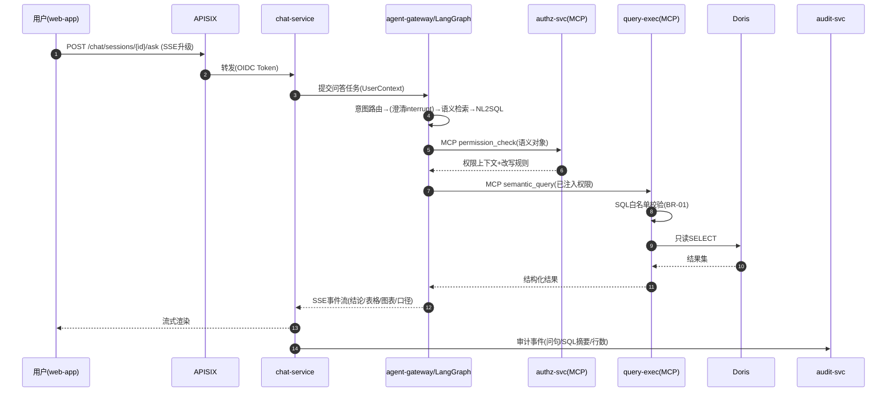
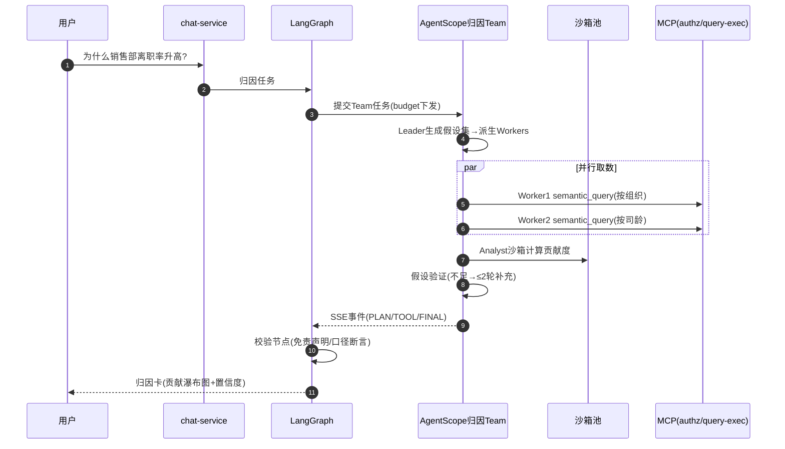

# HR智能问数 应用架构设计文档

| 文档属性 | 内容 |
|---|---|
| 产品名称 | HR智能问数（HR ChatBI） |
| 文档编号 | ARCH-HRCHATBI-001 |
| 版本号 | V1.0 |
| 文档状态 | 评审稿 |
| 架构描述标准 | ISO/IEC/IEEE 42010（系统与软件工程—架构描述） |
| 关联文档 | 《产品需求文档PRD-HRCHATBI-001》《技术选型文档TECH-HRCHATBI-001》《多智能体集成技术选型方案AGENT-HRCHATBI-001》《产品原型文档PROTO-HRCHATBI-001》 |
| 创建日期 | 2026-09-13 |
| 作者 | 架构组 |
| 密级 | 内部 |

### 修订历史

| 版本 | 日期 | 修订人 | 修订说明 |
|---|---|---|---|
| V1.0 | 2026-09-13 | 架构组 | 基于PRD/技术选型/多智能体方案输出应用架构设计文档 |

---

## 目录

1. [架构描述方法与文档结构（42010框架）](#1-架构描述方法与文档结构42010框架)
2. [利益相关者与架构关注点](#2-利益相关者与架构关注点)
3. [架构视点与视图定义](#3-架构视点与视图定义)
4. [V-01 上下文视图](#4-v-01-上下文视图)
5. [V-02 逻辑视图（模块划分与职责）](#5-v-02-逻辑视图模块划分与职责)
6. [V-03 依赖视图](#6-v-03-依赖视图)
7. [V-04 信息与数据流视图](#7-v-04-信息与数据流视图)
8. [V-05 运行时交互视图](#8-v-05-运行时交互视图)
9. [V-06 接口视图（接口设计规范）](#9-v-06-接口视图接口设计规范)
10. [V-07 安全视图](#10-v-07-安全视图)
11. [V-08 资源与性能视图](#11-v-08-资源与性能视图)
12. [V-09 部署视图](#12-v-09-部署视图)
13. [V-10 弹性与灾备视图](#13-v-10-弹性与灾备视图)
14. [V-11 开发与运维视图](#14-v-11-开发与运维视图)
15. [架构决策记录（ADR）](#15-架构决策记录adr)
16. [视图对应关系与一致性分析](#16-视图对应关系与一致性分析)

---

## 1. 架构描述方法与文档结构（42010框架）

### 1.1 标准符合性声明

本文档遵循 **ISO/IEC/IEEE 42010:2022** 架构描述框架组织：以**利益相关者关注点（Concerns）**为出发点，定义**架构视点（Viewpoints）**，每个视点产出**架构视图（Views）**与**架构模型**，所有关键选择附**决策依据（Rationale）**，并通过**对应关系（Correspondences）**保证视图间一致性。

### 1.2 架构描述元素关系

```
利益相关者(§2) ──提出──▶ 关注点(§2)
                            │
关注点 ──映射至──▶ 视点(§3) ──指导──▶ 视图(§4~§14) ──记录──▶ 架构决策ADR(§15)
                            │
视图间一致性 ──通过──▶ 对应关系分析(§16)
```

### 1.3 系统范围声明

- **在范围内**：HR域对话式问数、多维分析、报表订阅、语义层与权限管理、多智能体归因/洞察（V2）、管理后台
- **不在范围内**：HR业务系统本身（HRIS等）、数据写回操作、非HR域数据分析、BI大屏搭建

---

## 2. 利益相关者与架构关注点

| 编号 | 利益相关者 | 核心关注点 | 主要承载视图 |
|---|---|---|---|
| S1 | HR业务用户（HRBP/HRD/CHO） | 易用、秒级响应、数据准确可信 | V-01/05/08 |
| S2 | 产品经理 | 功能完整性、体验一致性、可演进 | V-02/05 |
| S3 | 前端/后端/算法工程师 | 职责清晰、接口契约、可测试性 | V-02/03/06/14 |
| S4 | 数据工程师 | 数据时效、质量、链路可监控 | V-04/08 |
| S5 | 安全与合规（含审计） | 敏感数据保护、权限不旁路、留痕合规 | V-07 |
| S6 | 运维/SRE | 可观测、可部署、故障恢复能力 | V-09/10/14 |
| S7 | 企业IT/客户方 | 私有化交付、与企业SSO/IM集成 | V-01/09 |
| S8 | 管理层 | 成本可控（GPU/Token）、风险可控 | V-08/11/15 |

**关键关注点（CC）清单**——本文所有视图围绕以下关注点展开：

| 编号 | 关注点 | 来源 |
|---|---|---|
| CC-1 | 自然语言查询P95<3s、复杂分析<10s、100 QPS | PRD 8.1 |
| CC-2 | 权限不旁路：任何数据访问经统一裁决 | PRD BR-02 |
| CC-3 | 敏感数据不出域、全程可审计3年 | PRD 8.3 / FR-20 |
| CC-4 | 语义层配置化，口径变更不发版 | PRD FR-21 / BR-04 |
| CC-5 | 可用性99.9%，故障时分级降级不中断 | PRD 8.2 / FR-24 |
| CC-6 | 数据准实时（异动≤15分钟） | PRD FR-15 |
| CC-7 | 多智能体协作可控（预算、熔断、可回放） | AGENT方案 |
| CC-8 | 私有化一键交付，支持后续SaaS演进 | TECH方案 |

---

## 3. 架构视点与视图定义

| 视点编号 | 视点名称 | 回答的问题 | 主要受众 | 建模范式 |
|---|---|---|---|---|
| V-01 | 上下文视图 | 系统边界在哪？与谁交互？ | 全体 | C4-Context / DFD-L0 |
| V-02 | 逻辑视图 | 由哪些模块组成？职责是什么？ | 研发/产品 | C4-Container / DDD模块化单体 |
| V-03 | 依赖视图 | 模块间如何依赖？禁止哪些依赖？ | 研发 | 分层依赖矩阵 |
| V-04 | 信息视图 | 数据从哪来到哪去？如何治理？ | 数据/安全 | DFD-L1 / 数据生命周期 |
| V-05 | 运行时交互视图 | 关键场景如何流转？ | 研发/测试 | 时序图 / 状态机 |
| V-06 | 接口视图 | 接口契约如何规范？ | 研发 | OpenAPI 3 / 事件Schema |
| V-07 | 安全视图 | 如何认证授权？如何保护数据？ | 安全/合规 | 纵深防御分层 / 威胁模型 |
| V-08 | 资源与性能视图 | 性能预算与容量如何分配？ | 研发/SRE | 预算表 / 容量模型 |
| V-09 | 部署视图 | 运行在什么物理形态上？ | SRE | K8s拓扑 / 网络分区 |
| V-10 | 弹性与灾备视图 | 故障了怎么办？RTO/RPO多少？ | SRE/管理 | 故障场景矩阵 / 备份策略 |
| V-11 | 开发与运维视图 | 如何开发、发布、观测、值班？ | 研发/SRE | 流水线 / SLO规范 |

---

## 4. V-01 上下文视图

### 4.1 系统上下文图

```
                          ┌──────────────────────────────┐
     HR业务用户            │                              │
  (HRBP/HRD/CHO/管理员) ──▶│                              │
          ▲                │                              │
          │ Web/IM-H5      │                              │
   ┌──────┴──────┐         │                              │
   │ IM平台       │◀──推送──│                              │
   │ 企微/钉钉/飞书 │         │                              │
   └─────────────┘         │        HR智能问数系统          │
                           │      (本系统边界)              │
   ┌─────────────┐         │                              │
   │ 企业SSO/IAM  │◀鉴权───▶│                              │
   └─────────────┘         │                              │
                           │                              │
   ┌─────────────┐  数据   │                              │
   │ HRIS        │◀──抽取──│                              │
   ├─────────────┤         │                              │
   │ 考勤系统     │◀──抽取──│                              │
   ├─────────────┤         │                              │
   │ 薪酬系统     │◀──抽取──│                              │
   ├─────────────┤         │                              │
   │ 绩效系统     │◀──抽取──│                              │
   ├─────────────┤         │                              │
   │ 招聘ATS     │◀──抽取──│                              │
   └─────────────┘         └──────────┬───────────────────┘
                                      │ 只读查询(Doris)
                              ┌───────▼───────┐
                              │ HR数仓(系统内)  │
                              └───────────────┘
```

### 4.2 外部实体与交互契约

| 外部实体 | 交互方向 | 协议 | 契约要点 |
|---|---|---|---|
| 企业SSO/IAM | 双向 | OIDC/OAuth2 | 登录鉴权、用户组同步；断连时拒绝新登录但保活已登录会话≤2h |
| HRIS | 入（抽取） | API/DB CDC | 组织/人员/异动；异动走CDC，延迟≤15min |
| 考勤/薪酬/绩效/ATS | 入（抽取） | API/DB批量 | T+1批量，每日06:00前完成；凭证最小权限只读账号 |
| IM平台 | 出 | 各平台开放API | 消息推送、机器人卡片；适配器模式隔离三平台差异 |
| 邮件网关 | 出 | SMTP | 报表订阅推送 |

**边界安全规则**：所有入站流量经APISIX网关；所有出站抽取使用只读凭证；系统不向任何外部系统回写数据（BR-01）。

---

## 5. V-02 逻辑视图（模块划分与职责）

### 5.1 容器级架构图

```
┌─────────────────────────── 客户端层 ────────────────────────────┐
│  web-app (React18+TS+Vite+AntD5+ECharts)  │  IM内嵌H5(轻量只读)  │
└──────────────────────────────┬─────────────────────────────────┘
┌──────────────────────────────▼── 接入层 ────────────────────────┐
│  APISIX网关：OIDC鉴权│限流│灰度路由│SSE透传│审计埋点              │
└──────┬───────────────────────────────┬─────────────────────────┘
┌──────▼───── Java应用层(模块化单体) ────▼──── Python AI运行时 ─────┐
│ ┌────────────┐ ┌────────────┐   ┌────────────────────────────┐ │
│ │ chat-service│ │report-svc  │   │ agent-gateway(FastAPI)      │ │
│ │ 问答会话编排 │ │报表CRUD/快照│   │  鉴权透传/会话路由/事件出栈    │ │
│ ├────────────┤ ├────────────┤   ├────────────────────────────┤ │
│ │subscription│ │semantic-svc│   │ LangGraph编排引擎            │ │
│ │ 订阅推送任务 │ │语义层元数据  │   │  问数状态机/澄清中断/降级     │ │
│ ├────────────┤ ├────────────┤   ├────────────────────────────┤ │
│ │ authz-svc  │ │admin-svc   │   │ AgentScope协作引擎           │ │
│ │ 权限中心/改写│ │管理后台API  │   │  归因Team/报告Team/沙箱调度   │ │
│ ├────────────┤ ├────────────┤   ├────────────────────────────┤ │
│ │ audit-svc  │ │query-exec  │   │ 统一适配层                   │ │
│ │ 审计服务    │ │查询执行/白名单│  │  Model/Tool(MCP)/Memory/Trace│ │
│ └────────────┘ └────────────┘   └────────────────────────────┘ │
└──────┬───────────────────────────────┬─────────────────────────┘
┌──────▼─────────── 数据与中间件层 ──────▼────────────────────────┐
│ Doris(OLAP数仓) │ MySQL(元数据) │ Redis(缓存/会话) │ Kafka(事件) │
│ pgvector(向量)  │ MinIO(文件)   │ Elasticsearch(审计,可选)        │
├──────────────────────────── 集成层 ────────────────────────────┤
│ DataX(T+1批量) │ Flink CDC(准实时) │ XXL-Job(调度)               │
├──────────────────────────── 基础设施 ──────────────────────────┤
│ K8s │ vLLM+Qwen(GPU池) │ Prometheus/Grafana/SkyWalking/ELK/Langfuse│
└───────────────────────────────────────────────────────────────┘
```

### 5.2 模块职责清单

| 模块 | 层 | 核心职责 | 关键非职责（明确不做） |
|---|---|---|---|
| web-app | 客户端 | 对话工作台/报表中心/管理后台SPA；SSE消费；无权限态渲染 | 不做任何数据过滤（信任服务端） |
| APISIX | 接入 | 认证前置校验、限流熔断、路由灰度、访问日志 | 不做业务鉴权（细粒度归authz-svc） |
| chat-service | 应用 | 会话管理、问答请求编排（调AI运行时）、上下文管理、反馈收集 | 不直接执行SQL |
| report-service | 应用 | 报表CRUD、快照生成、报表权限校验 | 不做订阅调度（归subscription） |
| subscription-service | 应用 | 订阅管理、定时触发（XXL-Job）、邮件/IM推送 | 不生成数据（调query-exec） |
| semantic-service | 应用 | 指标/维度/同义词元数据管理、版本与审批流、热更新 | 不做物理SQL拼装（模板引擎在AI层） |
| authz-service | 应用 | RBAC+行级范围+字段脱敏策略管理；**SQL权限改写**；权限热生效 | 不缓存跨用户权限结果（BR-05） |
| admin-service | 应用 | 数据源管理、同步监控、标注评测、审计检索后台 | — |
| audit-service | 应用 | 审计事件收集/存储/检索（≥3年）、敏感操作标记 | — |
| query-exec | 应用 | 只读SQL白名单校验、Doris执行、超时控制 | **禁止任何写操作**（BR-01） |
| agent-gateway | AI | Agent运行时入口：会话路由、UserContext透传、事件标准化 | 不做权限裁决（透传Java下发的权限上下文） |
| LangGraph引擎 | AI | 问数主链路状态机、澄清interrupt、Checkpoint、降级梯度 | 不执行物理查询（调MCP） |
| AgentScope引擎 | AI | 归因/报告Agent Team、Worker并发调度、预算熔断、沙箱调度 | 不做权限裁决；不直连Doris |
| 统一适配层 | AI | ModelAdapter（ai-gateway）、ToolRegistry（MCP客户端）、MemoryAdapter、TraceAdapter | — |
| mcp-server(Java) | 应用 | 将semantic_query/permission_check/report_save暴露为MCP工具 | — |

### 5.3 技术栈选型及理由（摘要，详见TECH文档ADR）

| 层 | 技术 | 选型理由（一句话） |
|---|---|---|
| 前端 | React18+TS+Vite+AntD5+ECharts5 | 团队既有栈；ECharts图型覆盖对比/下钻全部需求 |
| 应用层 | Java17+SpringBoot3模块化单体 | 权限/事务强逻辑团队成熟；单体降低交付复杂度，DDD分包预留拆分 |
| AI层 | Python3.11+LangGraph+AgentScope2.0 | 状态机可控性（LangGraph）与多Agent协作（AgentScope）分工；双框架经统一适配层收敛 |
| 模型 | Qwen2.5-72B/14B+vLLM自托管 | 数据不出域；14B/72B分级路由兼顾延迟与成本 |
| OLAP | Apache Doris 2.1 | HR场景多表Join强、CDC导入原生、MySQL协议兼容 |
| OLTP/缓存/消息 | MySQL8/Redis7/Kafka3 | 团队成熟、生态完备 |
| 部署 | K8s+Helm私有化 | 敏感数据合规优先；一键交付 |

---

## 6. V-03 依赖视图

### 6.1 分层依赖规则

```
客户端层 ──▶ 接入层 ──▶ 应用层 ──▶ 数据层
                        ▲
AI运行时 ──(MCP)────────┘   AI运行时 ──▶ 数据层(仅Redis/Kafka/MinIO/PG)
```

| 规则编号 | 依赖规则 | 违反后果 |
|---|---|---|
| D-1 | 应用层模块间**禁止直接访问对方数据库**，只能通过模块API | 编译期ArchUnit检查失败 |
| D-2 | AI运行时**禁止直连Doris/MySQL业务库**，取数必须经MCP→query-exec | 网络策略阻断（安全兜底） |
| D-3 | 客户端禁止直连任何数据服务，仅经APISIX | 网络不可达 |
| D-4 | audit-service为被依赖方，禁止依赖任何业务模块（避免循环） | 评审卡点 |
| D-5 | semantic-service不依赖authz-service；权限改写由authz单向提供给调用方 | 同上 |
| D-6 | AI运行时内部：LangGraph→AgentScope单向调用，禁止反向 | 评审卡点 |

### 6.2 模块依赖矩阵（→表示依赖）

| | chat | report | subs | semantic | authz | admin | audit | qexec | agent-gw |
|---|---|---|---|---|---|---|---|---|---|
| chat | — | | | → | → | | → | | → |
| report | | — | → | → | → | | → | → | |
| subscription | | → | — | → | → | | → | → | |
| semantic | | | | — | | | → | | |
| authz | | | | →(读元数据) | — | | → | | |
| admin | →(只读) | | | → | → | — | → | | |
| agent-gw(AI) | | | | 经MCP | 经MCP | | → | 经MCP | — |

---

## 7. V-04 信息与数据流视图

### 7.1 数据流总览（DFD Level 0 → Level 1）

```
L0: 源系统 --抽取--> HR数仓(Doris) --语义化--> 问答/报表引擎 --结果--> 用户
                      │
                      └──质量校验──隔离区/告警

L1(问数链路):
[用户问句] ─▶ APISIX ─▶ chat-service ─▶ agent-gateway
   ─▶ LangGraph: 意图/澄清 ─▶ 语义检索(pgvector+语义层)
   ─▶ NL2SQL(语义对象) ─▶ MCP:authz权限改写 ─▶ MCP:query-exec
   ─▶ Doris执行 ─▶ 结果 ─▶ 图表推荐/摘要 ─▶ SSE ─▶ 用户
   ─▶ 审计(audit-svc←问句/SQL/行数全程留痕)
```

### 7.2 数据分类分级（合规基础）

| 级别 | 数据示例 | 保护策略 |
|---|---|---|
| L3-敏感 | 薪酬明细、证件号、银行卡 | 字段加密存储(AES-256/SM4)、默认脱敏、明文查看审批+审计 |
| L2-内部 | 绩效结果、个人联系方式（脱敏后）、组织人事数据 | 行级权限+传输加密 |
| L1-公开 | 指标定义、维度枚举、模板 | 登录可见 |
| L0-系统 | 会话、审计日志、Agent轨迹 | 按S5关注点管理，审计≥3年 |

### 7.3 数据生命周期

| 数据 | 产生 | 存储 | 保留 | 销毁 |
|---|---|---|---|---|
| 问句/答案记录 | 每次问答 | MySQL+ES | ≥1年（会话90天软删） | 到期物理删除+备份同步清除 |
| 审计日志 | 全链路事件 | ES/MySQL | ≥3年 | 归档冷存储 |
| Agent轨迹/Checkpoint | 任务执行 | PG+Langfuse | 90天 | 自动过期 |
| 报表快照 | 订阅触发 | MinIO | 12个月滚动 | 生命周期策略 |
| 数仓明细 | ETL/CDC | Doris | 明细≥2年、汇总≥5年 | 分区淘汰 |

### 7.4 数据一致性要求

| 关系 | 一致性策略 |
|---|---|
| 权限变更 ↔ 生效 | 最终一致，≤5分钟（BR-12），Redis失效广播 |
| 语义层变更 ↔ 查询生效 | 审批通过后发布版本号，查询侧按版本加载（旧请求完成后再切换） |
| CDC异动 ↔ 可查询 | Kafka→Doris Routine Load，端到端≤15分钟 |
| 会话状态 ↔ 多副本 | Redis集中存储，副本无状态，无脑裂风险 |

---

## 8. V-05 运行时交互视图

### 8.1 核心场景SC-1：智能问数（含权限改写）



### 8.2 核心场景SC-2：归因分析（跨框架协作）



### 8.3 核心场景SC-3：报表订阅推送

```
XXL-Job定时 → subscription-service → 调query-exec生成数据 → 渲染快照(MinIO)
→ 按收件人逐个权限校验(authz) → IM/邮件推送(带Token链接) → 打开时实时鉴权(BR-13)
失败→重试3次→通知报表所有者
```

### 8.4 关键状态机

| 对象 | 状态机 | 详图 |
|---|---|---|
| 问答卡 | Skeleton→Clarifying/Completed/NoPermission/Failed/AsyncTimeout | 原型文档6.1 |
| Agent任务 | SUBMITTED→PLANNING→EXECUTING→AGGREGATING→DONE / BUDGET_CUT / FAILED | 本视图新增：预算触达强制收敛 |
| 口径变更 | 生效中→待审批→生效中/已驳回 | 原型文档6.4 |

---

## 9. V-06 接口视图（接口设计规范）

### 9.1 接口清单（按通道）

| 通道 | 接口族 | 协议 | 说明 |
|---|---|---|---|
| REST-BFF | /api/v1/chat、/reports、/admin/* | HTTPS+JSON | 前端唯一入口 |
| 流式 | /api/v1/chat/**/stream | SSE | 问答与Agent事件流 |
| 服务内 | 模块间API | REST(OpenFeign) | 应用层内部 |
| 跨栈 | MCP Tools | JSON-RPC over HTTP | Java↔AI运行时 |
| 异步 | Kafka Topics | JSON事件 | 订阅任务/Agent异步任务 |

### 9.2 REST设计规范

| 项 | 规范 |
|---|---|
| 版本 | URI版本 `/api/v1`；不兼容变更升级v2并保留v1六个月 |
| 资源命名 | 名词复数：`/sessions/{id}/answers`；动作型用子资源：`POST /reports/{id}:subscribe` |
| 方法语义 | GET幂等只读；POST创建/动作；PATCH部分更新；DELETE软删 |
| 分页 | `page/size`(默认1/20)，响应含`total/page/size/items` |
| 排序筛选 | `sort=field,-field2`；筛选参数平铺 |
| 幂等 | 写操作必带`X-Idempotency-Key`，服务端24h去重 |
| 错误模型 | 统一`{"code":"HRX-xxxx","message":"中文人话","trace_id":"...","details":[]}`；错误码段：HRX-1xxx参数/HRC-2xxx权限/HRS-3xxx系统/HRA-4xxx AI/HRD-5xxx数据 |
| 时间 | ISO-8601带时区 `2026-09-13T10:00:00+08:00` |
| 金额/比例 | 字符串传输（避免精度丢失），字段名带单位后缀（`amount_cny`） |
| 语言 | 服务端返回中文文案；code与message解耦 |

### 9.3 SSE事件规范（问答/Agent统一）

```json
{"seq": 12, "event": "TOOL_CALL_END", "ts": "...",
 "payload": {"tool": "semantic_query", "ms": 820, "rows": 42}}
```

| 规则 | 说明 |
|---|---|
| 事件类型枚举 | MESSAGE_DELTA / INTERRUPT / PLAN_UPDATE / TOOL_CALL_* / ANSWER_DONE / ERROR / HEARTBEAT |
| seq | 会话内单调递增，客户端乱序缓冲重排 |
| 心跳 | 15s HEARTBEAT防代理断连 |
| 断线恢复 | `Last-Event-ID` + 服务端Redis事件回放窗口5分钟 |

### 9.4 MCP工具契约

| 工具 | 入参（摘要） | 出参 | 权限 |
|---|---|---|---|
| semantic_query | metric[], dimension[], filter{}, time_range, org_context | 数据集JSON（含口径元数据） | authz强制改写 |
| permission_check | 语义对象 | 允许/拒绝+字段策略 | — |
| report_save | 名称/组件定义 | 报表ID | 报表创建权限 |
| get_semantic_meta | 指标/维度名 | 定义/口径/可用维度 | 登录即可 |

**契约治理**：所有接口OpenAPI 3 YAML入Git，CI执行Spectral lint + Pact契约测试；破坏性变更需架构评审。

---

## 10. V-07 安全视图

### 10.1 纵深防御分层

```
L1 边界: WAF/网关(OIDC前置校验/限流/防爬) 
L2 应用: 会话管理/操作级鉴权/输入校验(SQL注入与越权参数清洗)
L3 数据: 行级权限注入(SQL改写) + 字段级脱敏 + 加密存储
L4 AI专属: Agent取数唯一入口(MCP) + 预算熔断 + 沙箱隔离 + 输出内容校验
L5 审计: 全链路留痕/敏感操作标记/3年留存
```

### 10.2 认证与授权

| 项 | 方案 |
|---|---|
| 认证 | 企业SSO(IAM) OIDC；JWT(RS256)≤30min + Refresh Token；会话闲置30min过期 |
| 授权模型 | RBAC(功能) × 组织范围(行级) × 字段策略(列级) 三层叠加 |
| 行级实现 | authz-svc在SQL生成时注入`org_path IN (...)`，**禁止前端过滤**（BR-02） |
| 字段脱敏 | 策略引擎(LiteFlow规则)+Doris动态脱敏函数双保险；明文查看单独授权+审批 |
| 提权 | 权限变更实时生效≤5min；敏感授权双人审批 |

### 10.3 AI链路安全专项

| 威胁 | 防护 |
|---|---|
| Prompt注入（报表名/数据内容携带指令） | 数据内容进上下文前结构化包裹+指令过滤；Agent工具白名单；输出Schema强制校验 |
| Agent越权取数 | 红线1/2：权限由Java侧裁决并随任务下发；AI侧无凭证直连Doris（网络隔离） |
| 归因结论泄露敏感明细 | Writer输出经脱敏扫描器复检；贡献度仅输出聚合值 |
| 沙箱逃逸 | Docker无外网/只读卷/CPU内存时长限额/代码库白名单 |
| 模型数据外泄 | vLLM自托管；外部API兜底仅接触Schema不接触行数据 |
| 缓存越权 | 结果缓存键含权限上下文指纹（BR-05） |

### 10.4 合规映射

| 要求 | 实现锚点 |
|---|---|
| PIPL最小必要 | 字段按需查询、默认脱敏、导出行数限制（BR-06） |
| 数据安全法分级 | 7.2数据分级与对应策略 |
| 审计追溯 | audit-svc全量留痕≥3年（FR-20/BR-11） |
| 渗透测试 | 上线前无高危漏洞（PRD 9.4），年度复测 |

---

## 11. V-08 资源与性能视图

### 11.1 端到端性能预算（P95）

| 链路 | 环节预算 | 合计 |
|---|---|---|
| 简单问数 | 网关50ms + chat 100ms + 路由/澄清500ms + 检索200ms + NL2SQL 1.2s + 改写≤200ms + Doris 800ms + 渲染首包300ms | **<3.3s→优化至<3s**（NL2SQL流式+缓存） |
| 复杂分析 | 问数链路 + 下钻/对比多查询并行 | <10s |
| 归因分析 | 异步豁免 | <120s |
| 报表打开 | 查询+快照 | <5s |

### 11.2 缓存策略分层

| 层 | 内容 | TTL | 失效 |
|---|---|---|---|
| 语义缓存(AI) | 问句向量相似≥0.95+权限指纹一致的结果 | 随数据同步周期(T+1) | 数据更新事件 |
| 模板缓存(降级) | Top200问句预编译SQL | 长期 | 语义层变更事件 |
| 元数据缓存 | 指标/维度定义 | 5min | 语义层发布广播 |
| Schema缓存 | pgvector检索结果 | 1h | 同上 |

### 11.3 容量模型

| 资源 | 基线 | 扩容触发 |
|---|---|---|
| 应用Pod | 100 QPS/3副本chat | CPU>60%持续5min自动HPA |
| vLLM | 20并发简单问句 | 队列长度>10扩GPU |
| Doris | 100万人员规模数据 | 查询P95>1s加BE |
| 归因并发 | 20任务 | Redis Stream积压>50扩副本 |

### 11.4 QoS目标与度量

| 指标 | SLO | 度量来源 |
|---|---|---|
| 简单问数P95 | <3s | SkyWalking |
| 可用性 | 99.9% | Prometheus(5xx+超时) |
| NL2SQL准确率 | ≥90% | 标注集每日回归 |
| 归因120s收敛率 | ≥95% | Agent任务埋点 |
| 缓存命中率 | ≥30% | Redis指标 |

---

## 12. V-09 部署视图

### 12.1 生产部署拓扑

```
┌────────── K8s集群(≥3 Master, 多AZ Worker) ──────────────────┐
│ AZ-A                        │ AZ-B                          │
│  DMZ: APISIX×2, Ingress     │  DMZ: APISIX×2                │
│  应用区: chat/report/authz…×N│  应用区: 同规格副本(跨AZ)       │
│  AI区: agent-gw×3, AgentScope×2, 沙箱池          │
│  GPU池: vLLM(2×A800 72B) + (1×A10 14B/Embed)  跨AZ调度    │
│  中间件区: MySQL主备, Redis哨兵, Kafka×3, Doris FE×3+BE×4 │
│  数据区: MinIO(纠删码), PG(checkpoint/vector), ES       │
│  可观测: Prometheus/Grafana/SkyWalking/ELK/Langfuse      │
└────────────────────────────────────────────────────────────┘
```

### 12.2 环境与发布

| 环境 | 规格 | 数据 | 用途 |
|---|---|---|---|
| dev | 缩配+1×A10 | 脱敏样本数据 | 开发自测 |
| staging | 生产1:1缩配 | 脱敏全量结构数据 | 压测/回归/UAT |
| prod | 见12.1 | 真实数据 | 生产 |

**发布策略**：Helm Chart一键部署；应用滚动发布（maxSurge=1）；AI运行时金丝雀（5%→50%）；Doris/中间件变更窗口化；回滚=Helm revision回退（≤10分钟）。

### 12.3 网络与配置

| 项 | 策略 |
|---|---|
| 网络分区 | DMZ/应用/AI/数据四区NetworkPolicy隔离；AI区无出网（仅白名单vLLM/Langfuse内网） |
| 配置管理 | 配置中心(Nacos或K8s ConfigMap+Secret)；密钥Vault/Sealed Secrets，禁止明文入Git |
| 证书 | 内部CA+自动轮换；TLS1.2+ |

---

## 13. V-10 弹性与灾备视图

### 13.1 故障场景与自动处置矩阵

| 故障 | 检测 | 自动处置 | 兜底 |
|---|---|---|---|
| vLLM宕机 | 健康检查+超时 | ai-gateway切换云端API（仅Schema场景）→ LangGraph模板直查 | FR-24降级提示条 |
| LangGraph引擎崩溃 | K8s重启+Checkpoint | Pod重建后从PG Checkpoint恢复任务 | 任务标记失败可重试 |
| AgentScope Team卡死 | 预算超时熔断 | 强制收敛/取消 | LangGraph Fallback基础对比图 |
| Doris节点故障 | FE探活 | BE多副本自动接管 | 降级只读最近物化结果 |
| MySQL主库故障 | MHA/哨兵 | 自动主备切换(≤60s) | 只读模式公告 |
| Kafka分区不可用 | ISR告警 | 副本接管 | CDC任务断点重放 |
| 网关过载 | QPS/延迟 | 限流降级（非核心接口先降） | 排队+前端提示 |

### 13.2 降级梯度（统一机制）

```
L0 正常: 完整智能链路
L1 关Agent Team: 归因/洞察下线，问数正常
L2 关LLM生成: NL2SQL→Top200模板匹配直查
L3 极端: 只读报表中心+预设报表，问数下线
—— 每级均前端明示，可自动触发+人工强制
```

### 13.3 RTO/RPO与备份

| 数据/服务 | RPO | RTO | 备份策略 |
|---|---|---|---|
| MySQL(元数据) | ≤5min | ≤1h | 半同步主备+binlog+每日全备(异机) |
| Doris | ≤24h(可重建) | ≤4h | 每日增量快照至MinIO异机；源系统可全量重灌 |
| PG(Checkpoint/向量) | ≤15min | ≤2h | WAL归档+每日全备 |
| Redis | 可丢弃 | ≤15min | RDB每日+主从；缓存类不备份 |
| MinIO(快照/导出) | ≤24h | ≤4h | 纠删码+异地同步 |
| Kafka | ≤15min | ≤1h | 3副本ISR+配置备份 |
| 整站(私有化) | — | ≤8h | Helm包+镜像仓库异地副本+IaC脚本 |

### 13.4 灾备演练

| 演练 | 频率 | 通过标准 |
|---|---|---|
| 单组件故障切换（MySQL/Doris/vLLM） | 月度 | 按RTO表达标 |
| 降级梯度演练 | 月度 | L0→L3全链路可走通，前端提示正确 |
| 全量恢复演练（staging重灌） | 季度 | 备份可用性100% |
| 混沌工程（杀Pod/断网/注入延迟） | 双月 | 无数据损坏，告警10min内触发 |

---

## 14. V-11 开发与运维视图

### 14.1 工程结构规范

| 仓库 | 内容 | 规范要点 |
|---|---|---|
| hrchat-web | React SPA | pnpm monorepo；ESLint+Prettier+Stylelint；组件Storybook |
| hrchat-server | Java模块化单体 | Maven多模块=逻辑视图模块；ArchUnit守护D-1~D-5；SonarQube门禁（覆盖率≥70%核心模块） |
| hrchat-ai | Python运行时 | uv管理；ruff+mypy严格模式；LangGraph图定义与节点实现分离 |
| hrchat-deploy | Helm/IaC/契约 | OpenAPI YAML+SSE事件Schema+MCP契约单一事实源 |

### 14.2 分支与CI/CD

```
分支: main(受保护) ← MR ← feature/* ; 发布tag触发交付包
CI流水线: lint → 单测 → ArchUnit/契约测试 → 构建 → 镜像 → 安全扫描(Trivy) → staging部署 → 回归(500问句集+API回归) → 手动审批 → prod
AI专项门禁: 标注问句集准确率≥90%(事实类≥95%) 不达标禁止发布
```

### 14.3 测试策略

| 层级 | 工具 | 要求 |
|---|---|---|
| 单元 | JUnit5/pytest | 核心逻辑覆盖率≥70% |
| 契约 | Pact/Spectral | 前后端+跨栈接口CI强制 |
| 集成 | Testcontainers | MCP工具链路、权限改写用例 |
| E2E | Playwright | 原型文档9章验收清单自动化 |
| AI评测 | 标注问句集+Langfuse | 每日回归+发布门禁 |
| 性能 | Locust | 每迭代staging压测 |

### 14.4 可观测性规范

| 信号 | 标准 |
|---|---|
| 指标 | Prometheus四黄金信号+业务指标（问数成功率/准确率/缓存命中/Token消耗）；Grafana统一看板 |
| 日志 | JSON结构化；trace_id贯穿Java→AI→SQL；敏感字段(L3)禁止入日志（采集侧脱敏） |
| 链路 | SkyWalking全链路采样10%+异常100%；Agent轨迹Langfuse（与SkyWalking trace_id映射） |
| 告警 | 分级P0-P3；P0（可用性/数据同步失败/越权拦截激增）5min内电话；告警必须关联Runbook |

### 14.5 运维Runbook清单（必备）

| Runbook | 触发 |
|---|---|
| RB-01 vLLM故障切换与恢复 | 模型服务不可用 |
| RB-02 降级梯度手动切换/恢复 | 极端故障或大促保护 |
| RB-03 Doris节点替换 | 硬件故障 |
| RB-04 数据同步失败排查 | 同步监控告警 |
| RB-05 权限紧急回收 | 安全事件 |
| RB-06 Token成本异常排查 | 成本告警 |

### 14.6 变更与值班

- 变更分级：普通变更（走CI自动）/重要变更（评审+窗口）/紧急变更（事后24h补单）
- 值班：工作日SLE值班+发布冻结期（每月末结算日前后2天禁止Doris/权限类变更）

---

## 15. 架构决策记录（ADR）

| 编号 | 决策 | 状态 | 备选方案 | 理由 | 影响 |
|---|---|---|---|---|---|
| ADR-001 | 双语言栈：应用Java+AI Python | 已采纳 | 全Java/全Python | LLM生态Python不可替代；权限事务Java成熟；REST/MCP解耦 | 双栈协作成本→契约测试+Trace贯通缓解 |
| ADR-002 | 模块化单体起步，预留微服务拆分 | 已采纳 | 直接微服务 | 15周交付节奏；DDD分包+ArchUnit保证可拆性 | P2后按边界拆分 |
| ADR-003 | OLAP选Doris | 已采纳 | ClickHouse/StarRocks | HR多表Join关键优势；CDC原生 | 数据工程师需学习 |
| ADR-004 | 语义层元数据驱动NL2SQL（模板拼装） | 已采纳 | 端到端LLM直出SQL | 抑制幻觉、口径唯一（BR-04）、可审计 | 灵活性略降→few-shot持续回流 |
| ADR-005 | 模型自托管vLLM+分级路由 | 已采纳 | 纯API | 数据不出域；边际成本趋零 | GPU资本开支 |
| ADR-006 | 双框架分工：LangGraph流程+AgentScope协作 | 已采纳 | 单框架 | 状态机可控性 vs 动态协作，各取所长 | 双框架复杂度→统一适配层收敛 |
| ADR-007 | Agent取数唯一入口=MCP(Java裁决) | 已采纳 | AI直连Doris | 权限不旁路（CC-2）红线 | 链路增加一跳≈200ms，可接受 |
| ADR-008 | 私有化K8s交付 | 已采纳 | 公有云全托管 | 薪酬数据合规（CC-3） | 运维投入增加 |
| ADR-009 | SSE为主流式通道 | 已采纳 | WebSocket | 单向够用、网关友好、自动重连 | 双向需求（协作编辑）出现时局部补WS |
| ADR-010 | 三级降级梯度 | 已采纳 | 单一降级 | 故障半径逐级收敛（CC-5） | 需月度演练保障 |

---

## 16. 视图对应关系与一致性分析

### 16.1 关注点覆盖矩阵（关注点 × 视图）

| | V-01 | V-02 | V-03 | V-04 | V-05 | V-06 | V-07 | V-08 | V-09 | V-10 | V-11 |
|---|---|---|---|---|---|---|---|---|---|---|---|
| CC-1 性能 | | ✔ | | ✔ | ✔ | ✔ | | ● | | | ✔ |
| CC-2 权限不旁路 | | ● | ● | | ✔ | ✔ | ● | | ✔ | | |
| CC-3 数据安全合规 | | | | ● | | | ● | | ✔ | ✔ | ✔ |
| CC-4 配置化 | | ✔ | | ✔ | | ✔ | | ✔ | | | ✔ |
| CC-5 可用性降级 | | | | | ✔ | | | ✔ | | ● | ✔ |
| CC-6 数据时效 | | | | ● | ✔ | | | | | | ✔ |
| CC-7 Agent可控 | | ✔ | ● | | ● | ✔ | ✔ | ● | | ✔ | |
| CC-8 私有化交付 | ✔ | | | | | | ✔ | | ● | ✔ | ✔ |

（●=主要承载 ✔=相关支撑）

### 16.2 跨视图一致性检查清单

| 检查项 | 涉及视图 | 结论 |
|---|---|---|
| 模块清单与部署单元一一对应 | V-02 ↔ V-09 | 一致（应用单体=1部署单元；AI运行时2个） |
| 权限链路在依赖、时序、安全三视图表述一致 | V-03/05/07 | 一致（MCP唯一入口+SQL改写） |
| 性能预算与PRD非功能指标一致 | V-08 ↔ PRD 8.1 | 一致（P95<3s/<10s/100QPS） |
| 降级梯度与PRD FR-24一致并细化 | V-10 ↔ PRD | 一致（三级细化） |
| 数据保留期与审计需求一致 | V-04 ↔ PRD FR-20 | 一致（≥3年） |
| 接口错误模型与前端异常态文案规范一致 | V-06 ↔ 原型5.5 | 一致（code分段映射空状态） |

### 16.3 未决事项（演进项）

| 编号 | 事项 | 处理窗口 |
|---|---|---|
| O-1 | 微服务拆分边界细化（chat/report先行） | P2启动前 |
| O-2 | SaaS多租户隔离模型（库级/Schema级） | E5演进前 |
| O-3 | ES审计引入时机（日志量>5000万） | 容量触发 |

---

> **文档使用说明**：开发团队以V-02/V-03/V-06为日常实现依据；测试以V-05/V-06为用例设计输入；SRE以V-09/V-10/V-11为运维基线；架构变更须以ADR增补方式更新本文档并跑通16.2一致性检查。
